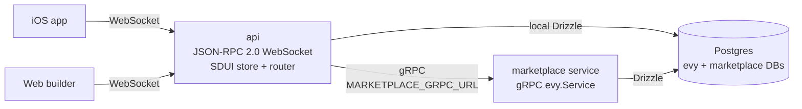

# EVY

If smartphones and the internet were built by the people for the people. Create services on the EVY platform and get paid every time your contribution is used. The EVY app is privacy-focused, local-first and peer-to-peer.

## Architecture at a glance

EVY is split into thin clients (iOS, web builder), one public edge (`api`), and per-namespace backend services that speak a shared gRPC contract (`evy.Service`). The main `api` stores SDUI flows locally and proxies every other namespace to the right backend.



- `namespace: "evy"` + `resource: "sdui"` reads/writes `UI_Flow` documents owned by `api`.
- Every other namespace is routed over gRPC; each non-`evy` namespace must declare a `<NAMESPACE>_GRPC_URL` env var.
- Real-time updates are pushed back to clients as standard JSON-RPC notifications (`flowUpdated`, `dataUpdated`). Remote services emit via `evy.Service.SubscribeEvents`, which the `api` fans out to connected clients.

See [`api/README.md`](./api/README.md) for the full request/notification sequence diagrams.

# Documentation

- EVY Platform
  - [Types](./docs/evy/types.md)
  - [Data models](./docs/evy/sddata/data.md)
  - [Functions](./docs/evy/sddata/functions.md)
  - [Server Driven UI](./docs/evy/sdui/readme.md)
- Marketplace
  - [Data models](./docs/services/marketplace/data.md)
  - [Example data](./docs/services/service_data.json)
  - [Example UI flow for view & create item pages](./docs/services/service_sdui.json)
- [API](./api/README.md)
- [Marketplace service](./services/marketplace/README.md)
- [iOS](./ios/README.md)
- [Web](./web/README.md)

## Shared type system

Cross-platform contracts live in **`types/`**

- **Source of truth:** `types/schema/` — JSON Schema files for UI flow types (`UI_*`), shared data rows (`DATA_EVY_*`), and JSON-RPC payloads.
- **Generated manually:** `types/generated/ts/` and `types/generated/swift/`.
- **Internal gRPC IDL:** `types/schema/service.proto` — `evy.Service` contract implemented by data-only backend services; the `api` uses [`api/src/services.ts`](./api/src/services.ts) (local adapter for `evy` namespace, gRPC clients for others).

After changing any definitions in `types/schema/`, run `bun run types:generate`

## Setup

1. Install [Bun](https://bun.sh/)
2. Install [Docker](https://www.docker.com/)
3. Copy `.env.example` to `.env`

## Running Services

### Development (with Docker Compose)

Run Postgres, the marketplace service, the main API, and the web app:

```bash
docker compose up --build
```

Copy `.env.example` to `.env`. The first `bun run db:seed` from the repo root creates the `marketplace` database if needed and seeds both services.

**Local Bun (no Docker for Node):** start Postgres (`docker compose up --build postgres`), then in separate terminals from the repo root:

```bash
bun install
bun run db:seed

cd services/marketplace && bun install && bun run dev
```

```bash
cd api && bun install && bun run dev
```

```bash
cd web && bun install && bun run dev
```

Ensure `.env` includes `MARKETPLACE_GRPC_URL` (e.g. `localhost:8001`, host:port with no scheme) so the main API can reach the marketplace gRPC server.

### Production (with Docker Compose)

Uses pre-built images from GitHub Container Registry (requires authentication):

```bash
docker compose -f docker-compose.prod.yml up
```

## End to end testing

`./run-e2e.sh` runs API, web, and iOS end-to-end tests with docker

You can optionally skip the iOS tests (which are heavy and slow) by running `./run-e2e.sh --skip-ios`

For even faster run you can keep running the API and web directly via Bun, and postgres via docker, then run `./run-e2e.sh --skip-ios --no-docker`

If port `3000` is already in use locally, run with an override (values set before the script win over `.env`): `WEB_PORT=3001 ./run-e2e.sh --skip-ios`.

## CI

CI uses a custom Docker image with Playwright, Bun, and PostgreSQL pre-installed (`ghcr.io/evy-platform/evy-ci`). The E2E workflow starts PostgreSQL from inside that image instead of pulling a separate GitHub Actions service container.

If you change `.github/images/ci/Dockerfile`, rebuild and publish the CI image before depending on the new tools in a workflow. See `.github/images/ci/Dockerfile` and `.github/workflows/push-ci-image.yml`.
