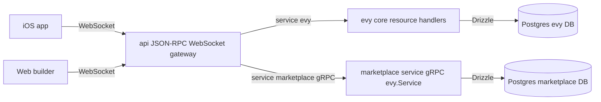

# EVY

If smartphones and the internet were built by the people for the people. Create services on the EVY platform and get paid every time your contribution is used. The EVY app is privacy-focused, local-first and peer-to-peer.

## Architecture at a glance

EVY is fully server-driven, meaning that the iOS app pulls flows, page layout, and data from the API to decide what to render. The API is a JSON-RPC 2.0 WebSocket gateway: `service: "evy"` requests are handled by evy core resource modules in the API process, while non-evy services such as `marketplace` are forwarded over the shared `evy.Service` gRPC contract. Clients store public data locally and keep it fresh with the protected `sync` JSON-RPC method, passing `lastSyncTime` so the API can return changed rows and the resource registry.


```mermaid
flowchart LR
    ios[iOS app]
    web[Web builder]

    api[api JSON-RPC WebSocket gateway]
    core[evy core resource handlers]
    marketplace[marketplace service gRPC evy.Service]
    evyDb[(Postgres evy DB)]
    mpDb[(Postgres marketplace DB)]

    ios -- WebSocket --> api
    web -- WebSocket --> api
    api -- service evy --> core
    core -- Drizzle --> evyDb
    api -- service marketplace gRPC --> marketplace
    marketplace -- Drizzle --> mpDb
```

# Documentation

- EVY Platform
  - [Types](./docs/evy/types.md)
  - [Data models](./docs/evy/sddata/data.md)
  - [Functions](./docs/evy/sddata/functions.md)
  - [Server Driven UI](./docs/evy/sdui/readme.md)
  - [API](./api/README.md)
  - [iOS](./ios/README.md)
  - [Web](./web/README.md)
  - [Android](./android/README.md) (placeholder; no app in this repo yet)
- [Marketplace](./services/marketplace/README.md)
  - [Data models](./docs/services/marketplace/data.md)
  - [Example data](./docs/services/service_data.json)
  - [Example UI flow for view & create item pages](./docs/services/service_sdui.json)

## Setup

1. Install [Bun](https://bun.sh/)
2. Install [Docker](https://www.docker.com/)
3. Copy `.env.example` to `.env`

## Running Services

### Development (with Docker Compose)

Run Postgres, the marketplace service, the main API, and the web app:

```bash
docker compose up --build
```

Copy `.env.example` to `.env`. The first `bun run db:seed` from the repo root creates the `marketplace` database if needed and seeds both services. The API discovers non-evy service resources through each service's `ListResources` gRPC method and exposes the combined runtime registry through the `resources` and `sync` JSON-RPC responses.

Local Bun (no Docker for Node): start Postgres (`docker compose up --build postgres`), then in separate terminals from the repo root:

```bash
bun install
bun run db:seed

cd services/marketplace && bun install && bun run dev
cd api && bun install && bun run dev
cd web && bun install && bun run dev
```

**gRPC (`MARKETPLACE_GRPC_*`):** Same variable names are used for API dial target and marketplace listen address—see comments in [`.env.example`](./.env.example) and [API prerequisites](./api/README.md#prerequisites). Local processes on the host: use `127.0.0.1`; do not use `0.0.0.0` as the API’s client target.

### Production (with Docker Compose)

Uses pre-built images from GitHub Container Registry (requires authentication):

```bash
docker compose -f docker-compose.prod.yml up
```

## End to end testing

`./run-e2e.sh` runs API, web, and iOS end-to-end tests with docker

You can optionally skip the iOS tests (which are heavy and slow) by running `./run-e2e.sh --skip-ios`

For even faster run you can keep running the API and web directly via Bun, and postgres via docker, then run `./run-e2e.sh --skip-ios --no-docker`

If port `3000` is already in use locally, run with an override (values set before the script win over `.env`): `WEB_PORT=3001 ./run-e2e.sh --skip-ios`.

## CI

All workflows install Bun via `.github/actions/setup-bun` (`oven-sh/setup-bun@v2`) and gate steps on `dorny/paths-filter` so unrelated PRs are no-ops.

Runners by workflow:
- API lint/build/tests, web lint: `ubuntu-latest`.
- Web tests (`.github/workflows/web_tests.yml`): `blacksmith-4vcpu-ubuntu-2404-arm`; installs Playwright via `bun run test:setup`.
- E2E (`.github/workflows/e2e_tests.yml`): `blacksmith-6vcpu-macos-26`. PostgreSQL is started on the host via Homebrew, then `./run-e2e.sh --no-docker` runs API, marketplace, web, and iOS Simulator tests with the runner's default Xcode image. iOS tests prefer iPhone 17 / iOS 26.5 and fall back to an available iPhone 17 simulator if the image changes.
