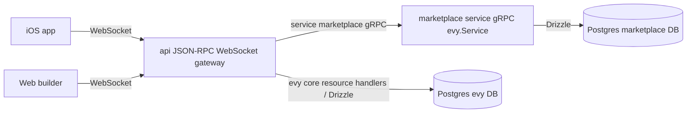

# EVY

If smartphones and the internet were built by the people for the people. Create services on the EVY platform and get paid every time your contribution is used. The EVY app is privacy-focused, local-first and peer-to-peer.

## Architecture


```mermaid
flowchart LR
    ios[iOS app]
    web[Web builder]

    api[api JSON-RPC WebSocket gateway]
    marketplace[marketplace service gRPC evy.Service]
    evyDb[(Postgres evy DB)]
    mpDb[(Postgres marketplace DB)]

    ios -- WebSocket --> api
    web -- WebSocket --> api
    api -- evy core resource handlers / Drizzle --> evyDb
    api -- service marketplace gRPC --> marketplace
    marketplace -- Drizzle --> mpDb
```

## Documentation

- EVY Platform
  - [Data](./docs/evy/data.md)
  - [Functions](./docs/evy/functions.md)
  - [Server Driven UI](./docs/evy/sdui.md)
  - [API](./api/README.md)
  - [iOS](./ios/README.md)
  - [Web](./web/README.md)
  - [Android](./android/README.md)
- [Marketplace](./services/marketplace/README.md)
  - [Data models](./docs/services/marketplace/data.md)
  - [Example data](./docs/services/service_data.json)
  - [Example UI flow for view & create item pages](./docs/services/service_sdui.json)

## Setup

1. Install [Bun](https://bun.sh/)
2. Install [Docker](https://www.docker.com/)
3. Copy `.env.example` to `.env`

## Running Services

### Development

#### All-in-one with Docker

Run Postgres, the marketplace service, the main API, and the web app:

```bash
docker compose up --build
```

#### Postgres + Bun dev for all apps

Start Postgres (`docker compose up --build postgres`), then in separate terminals from the repo root:

```bash
bun install
bun run db:seed

cd services/marketplace && bun run dev
cd api && bun run dev
cd web && bun run dev
```

### Production (with Docker Compose)

Uses pre-built images from GitHub Container Registry (requires authentication):

```bash
docker compose -f docker-compose.prod.yml up
```

## End to end testing

`./run-e2e.sh` runs API, web, and iOS end-to-end tests with docker.

You can optionally skip the iOS tests (which are heavy and slow) by running `./run-e2e.sh --skip-ios`

For even faster run you can keep running the API and web directly via Bun, and postgres via docker, then run `./run-e2e.sh --skip-ios --no-docker`

## CI

- API lint, build, and tests, and web lint run on Linux.
- Web tests run on Linux and install Playwright before running.
- E2E tests run on macOS. PostgreSQL is started on the host, then `./run-e2e.sh --no-docker` runs API, marketplace, web, and iOS Simulator tests. iOS tests target iPhone 17 / iOS 26.5.
