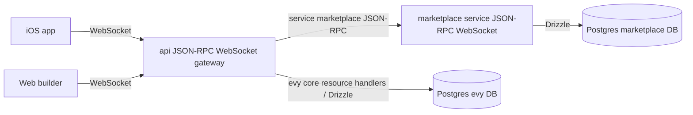

# EVY

Imagine smartphones and the internet built by the people, for the people. We want to enable anyone to connect consumers to services, free from gatekeepers taking a cut, and compensate contributors fairly.

A driver could deliver food without a middleman taking 30%. You could sell your skateboard without your data being used to target you with ads. Bringing these services together in one open platform means you can use the same identity and payment setup, instead of downloading another app, signing up and entering your details each time.

That is the vision for EVY. Its code and data are open for anyone to inspect, so people can verify how it works. Private data stays protected and is shared only with the parties who need it, such as an address sent directly to the driver making a delivery, not to the cloud.

EVY starts with a simple idea: a super app on your phone that acts as your identity and your key. The app is community built, and those contributors get paid when an in-app transaction uses their functionality, giving them a reason to build useful features.

A server-driven UI system lets contributors develop, test and release functionality that people can use as it becomes available. Shared components and themes give the app a consistent design and familiar controls across services.

## Architecture


```mermaid
flowchart LR
    ios[iOS app]
    web[Web builder]

    api[api JSON-RPC WebSocket gateway]
    marketplace[marketplace service JSON-RPC WebSocket]
    evyDb[(Postgres evy DB)]
    mpDb[(Postgres marketplace DB)]

    ios -- WebSocket --> api
    web -- WebSocket --> api
    api -- evy core resource handlers / Drizzle --> evyDb
    api -- service marketplace JSON-RPC --> marketplace
    marketplace -- Drizzle --> mpDb
```

## Documentation

- EVY Platform
  - [Data](./docs/evy/data.md)
  - [Hooks](./docs/evy/hooks.md)
  - [Methods](./docs/evy/methods.md)
  - [Comparisons](./docs/evy/comparisons.md)
  - [Formatting](./docs/evy/formatting.md)
  - [Actions](./docs/evy/actions.md)
  - [Server Driven UI](./docs/evy/sdui.md)
- Platform
  - [API](./api/README.md)
  - [iOS](./ios/README.md)
  - [Web](./web/README.md)
- Services
  - [Marketplace](./services/marketplace/README.md)
    - [Data models](./docs/services/marketplace/data.md)
    - [Example data](./scripts/fixtures/services/service_data.json)
    - [Example UI flow for view & create item pages](./scripts/fixtures/services/service_sdui.json)

## Setup

1. Install [Bun](https://bun.sh/)
2. Install [Docker](https://www.docker.com/)
3. Copy `.env.example` to `.env`

## Running Services

### Development

#### All-in-one (`bun dev`)

Run Postgres (in Docker), the marketplace service, the main API, and the web app:

```bash
bun dev
```

This will watch for file changes in any project and restart them as well as re-generate types

#### Postgres + manual running of each app

Start Postgres (`docker compose up --build postgres`), then in separate terminals from the repo root:

```bash
bun install
bun run types:generate
bun run db:seed

cd services/marketplace && bun run dev
cd api && bun run dev
cd web && bun run dev
```

### Production (with Docker Compose)

Uses pre-built images from GitHub Container Registry (requires authentication). Also copy
`.env.prod.example` and merge it with `.env` (Traefik/domain variables — see that file's
header for how it combines with `.env.example`):

```bash
docker compose -f docker-compose.prod.yml up
```

## End to end testing

`./run-e2e.sh` runs API, web, and iOS end-to-end tests with Docker Compose.

You can optionally skip the iOS tests (which are heavy and slow) by running `./run-e2e.sh --skip-ios`

The `--ci` flag is intended for CI only and is not meant for regular local runs. It runs API, marketplace, and web directly with Bun and expects PostgreSQL to already be running on the host. It exists because the macOS CI runner cannot run a container runtime (no nested virtualization), so PostgreSQL is provided on the host instead. For local development, use `./run-e2e.sh` (or `./run-e2e.sh --skip-ios`) rather than `--ci`.

## CI

- API lint, build, and tests, and web lint run on Linux.
- Web tests run on Linux and install Playwright before running.
- E2E tests run on macOS with `./run-e2e.sh --ci`. PostgreSQL is started on the host (the macOS runner cannot run Docker), then API, marketplace, web, and iOS Simulator tests run with Bun. iOS tests target iPhone 17 / iOS 26.5.
