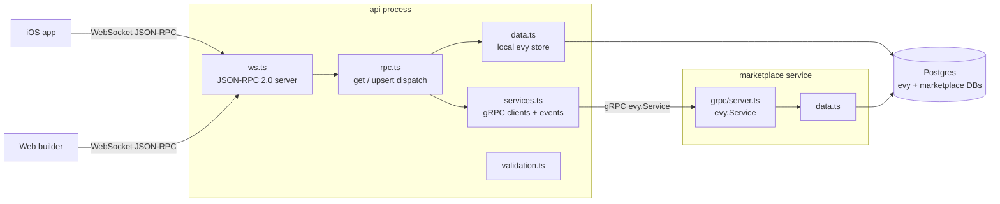
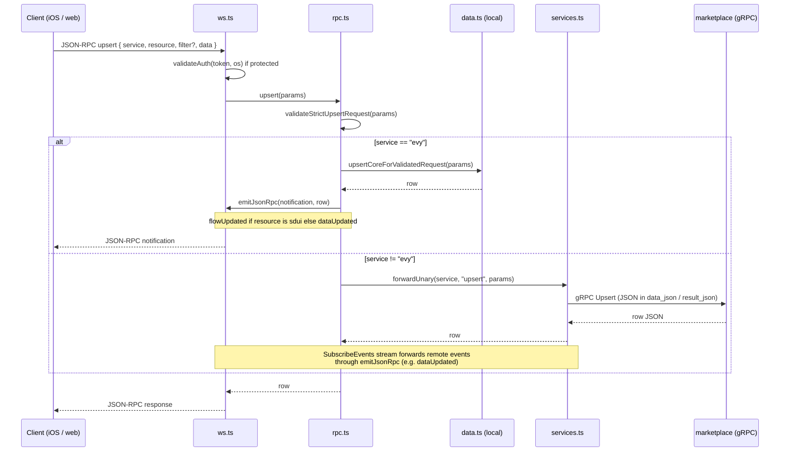
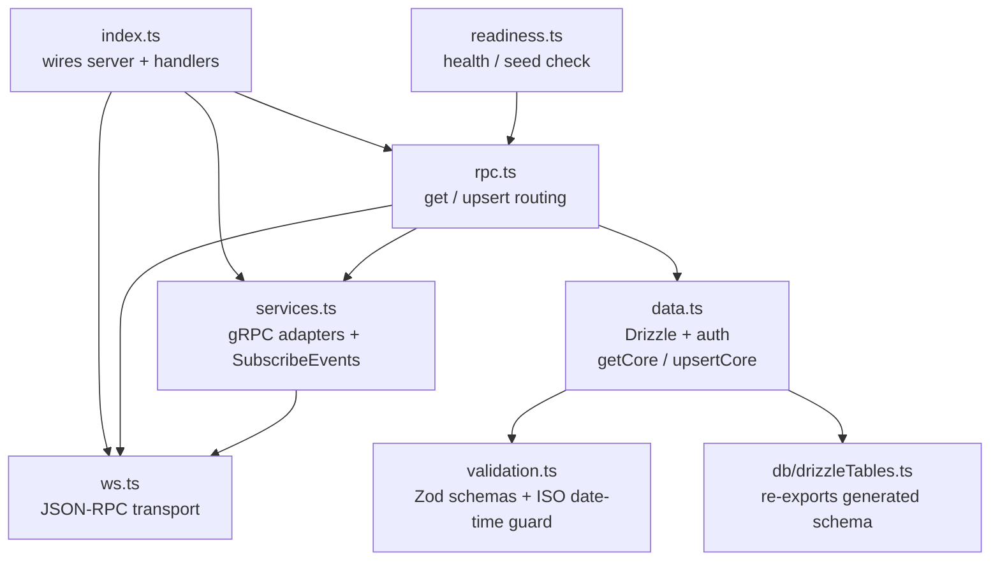

# EVY API

Main API for EVY. A JSON-RPC 2.0 WebSocket server (via [`rpc-websockets`](https://github.com/elpheria/rpc-websockets)) that handles `service: "evy"` in-process (SDUI flows and core tables), forwards other services over gRPC, and pushes real-time `dataUpdated` / `flowUpdated` notifications to connected clients.

## Architecture

### System view

The API is the only public edge for iOS and the web builder. Requests are validated against [`types/schema/rpc/`](../types/schema/rpc) and routed by **`service` + `resource`** in [`src/rpc.ts`](./src/rpc.ts): `service === "evy"` goes to [`src/data.ts`](./src/data.ts); any other registered service uses [`src/services.ts`](./src/services.ts) to call gRPC. Every non-`evy` service must declare `${SERVICE}_GRPC_HOST` and `${SERVICE}_GRPC_PORT` (see `SERVICE_VALUES` in generated types / [`src/services.ts`](./src/services.ts)).



### Request dispatch

`get` is public, `upsert` is protected (requires a valid device token via `validateAuth`). Params include **`service`**, **`resource`**, optional **`filter.id`**, and for `upsert` a **`data`** object (see JSON Schemas under `types/schema/rpc/`).

- **`service: "evy"`** &mdash; handled entirely in [`src/data.ts`](./src/data.ts). Supported resources include `sdui` (flows / `flow` table), `devices` (via auth only for writes), `organisations`, `services`, and `providers` (typed catalog tables). There is no generic `evy` “data” table routed through `services.ts`.
- **`service` ≠ `"evy"`** (e.g. `marketplace`) &mdash; [`src/rpc.ts`](./src/rpc.ts) calls `forwardUnary` in [`src/services.ts`](./src/services.ts), which issues `Get` / `Upsert` on `evy.Service` and validates JSON responses.



### Real-time notifications

`ws.ts` registers two server events (`dataUpdated`, `flowUpdated`) and ships a custom `emitJsonRpc` helper because `rpc-websockets` emits a non-standard wire shape that `JsonRPC.swift` on iOS cannot parse. All pushed frames therefore use standard JSON-RPC 2.0:

```json
{ "jsonrpc": "2.0", "method": "dataUpdated", "params": { /* row */ } }
```

- Successful **`evy`** upserts call `emitJsonRpc` from [`src/rpc.ts`](./src/rpc.ts): `flowUpdated` when `resource === "sdui"`, otherwise `dataUpdated`.
- Remote services emit named events on `evy.Service.SubscribeEvents`; [`src/services.ts`](./src/services.ts) parses `payload_json` and forwards them with the same `emitJsonRpc` helper (reconnect with exponential backoff).

### Internal module layout



- `db/drizzleTables.ts` simply re-exports `types/generated/ts/db/schema.generated.ts`; the schema itself comes from `types/schema/data/` via `bun run types:generate`.
- `validation.ts` enforces that any JSON key ending in `At` or `_timestamp` (plus explicit exceptions) is an ISO 8601 string &mdash; never a Unix number &mdash; before it reaches Postgres.

### Shared contracts

| File | Purpose |
|------|---------|
| [`types/schema/service.proto`](../types/schema/service.proto) | `evy.Service` gRPC IDL implemented by every non-`evy` backend |
| [`types/schema/data/data.schema.json`](../types/schema/data/data.schema.json) | JSON Schema for `DATA_EVY_*` rows |
| [`types/schema/sdui/evy.schema.json`](../types/schema/sdui/evy.schema.json) | `UI_Flow` / `UI_Page` / `UI_Row` contract |
| [`types/schema/rpc/*.schema.json`](../types/schema/rpc) | `GetRequest` / `UpsertRequest` / `GetResponse` contracts |

## Prerequisites

- [Bun](https://bun.sh/) installed on your system
- PostgreSQL database (or use Docker Compose)

Ensure your root env file (`../.env`) is set with the .env.example. The following environment variables are used by the API:

```env
API_PORT=8000
DB_USER=evy
DB_PASS=evy
DB_PORT=5432
DB_DOMAIN=localhost
DB_EVY_DATABASE=evy
# Required for each non-evy service (URL is host:port); see api/src/services.ts
MARKETPLACE_GRPC_HOST=0.0.0.0
MARKETPLACE_GRPC_PORT=8001
```

## Getting Started

### Installation

```bash
bun install
```

### Database Setup

Run migrations to set up the database schema:

```bash
bun run db:migrate
```

### Running the dev server with hot-reload

```bash
bun run dev
```

### Docker

```bash
docker build -t evy-api .
docker run -p 8000:8000 \
  -e DB_USER="user" \
  -e DB_PASS="password" \
  -e DB_PORT="5432" \
  -e DB_DOMAIN="host" \
  -e DB_EVY_DATABASE="evy" \
  -e MARKETPLACE_GRPC_HOST="marketplace" \
  -e MARKETPLACE_GRPC_PORT="8001" \
  evy-api
```

### Docker Compose

From the repo root (the API has no `docker-compose.yml` in its directory):

```bash
docker compose up -d api
```

## Available Scripts

| Script                 | Description                              |
| ---------------------- | ---------------------------------------- |
| `bun run dev`          | Start server with hot reload             |
| `bun run build`        | Build for production                     |
| `bun run start`        | Run migrations and start server          |
| `bun run health`       | Run the readiness check                  |
| `bun run health:seeded` | Run readiness check and require seed data |
| `bun run test`         | Run API unit and integration tests       |
| `bun run test:e2e`     | Run API end-to-end tests                 |
| `bun run lint`         | Run Biome linter                         |
| `bun run format`       | Format files with Biome                  |
| `bun run db:generate`  | Generate migration from schema changes   |
| `bun run db:migrate`   | Apply pending migrations                 |
| `bun run db:push`      | Push schema directly (dev only)          |
| `bun run db:studio`    | Open Drizzle Studio UI                   |
