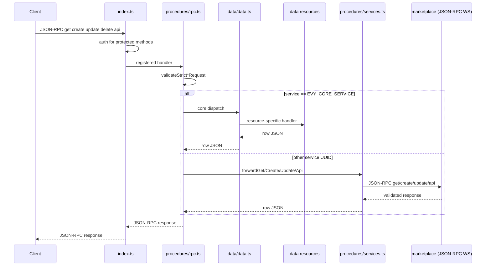
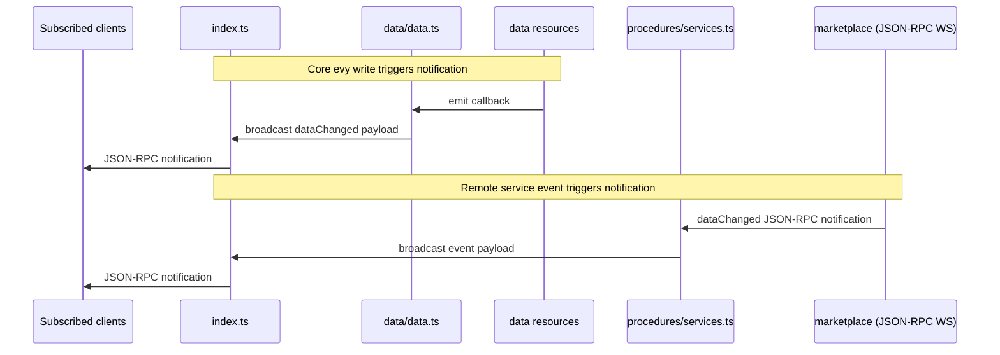

# EVY API

WebSocket API that routes data requests to the proper service, handles evy core resources, and pushes/forwards `dataChanged` notifications when data changes.

## Architecture

### Request dispatch

Incoming JSON-RPC messages are authenticated where required, validated, then dispatched based on `service`. `service` is always a UUID: requests whose value matches the generated core service id (`EVY_CORE_SERVICE`, exported from `evy-types/coreResources`) are handled by evy core resource modules. All other services are forwarded to the appropriate backend over JSON-RPC (WebSocket). Note the literal string `"evy"` is not a valid `service` value.


```mermaid
sequenceDiagram
    participant Client
    participant index as index.ts
    participant rpc as procedures/rpc.ts
    participant data as data/data.ts
    participant resource as data resources
    participant services as procedures/services.ts
    participant marketplace as marketplace (JSON-RPC WS)

    Client->>index: JSON-RPC get create update delete api
    index->>index: auth for protected methods
    index->>rpc: registered handler
    rpc->>rpc: validateStrict*Request

    alt service == EVY_CORE_SERVICE
        rpc->>data: core dispatch
        data->>resource: resource-specific handler
        resource-->>data: row JSON
        data-->>rpc: row JSON
    else other service UUID
        rpc->>services: forwardGet/Create/Update/Api
        services->>marketplace: JSON-RPC get/create/update/api
        marketplace-->>services: validated response
        services-->>rpc: row JSON
    end

    rpc-->>index: JSON-RPC response
    index-->>Client: JSON-RPC response
```

### Procedures

`api{service, method, data}` calls a procedure rather than reading a resource. Which procedures exist, who owns them, what they accept and return, and how often they may be called are all declared in `types/schema/resources/procedures.json` and generated into `evy-types/procedures`.

- `procedures/coreApi.ts` dispatches the procedures the gateway owns, validating request and response against the declared schemas. It asserts at load that its handler set matches the registry, so a procedure cannot become reachable without being declared — and therefore cannot skip its rate limit.
- `procedures/rpc.ts` forwards a procedure declared for another service to that service's `api` method. A method the registry does not pair with the target service is rejected by name.
- `procedures/rateLimit.ts` enforces `rateLimit.perMinute` per socket, in fixed one-minute windows. `place_search` is capped because each result costs two Google Places lookups.

See [docs/evy/data.md](../docs/evy/data.md#procedures) for the manifest fields and how to add one.

### Concurrent writers

`update` and `delete` accept an optional `filter.expectedUpdatedAt`. When present the write only applies if the stored row still carries that `updatedAt`; otherwise it is rejected as a conflict rather than silently overwriting. Omitting it keeps last-write-wins, so clients that do not track versions are unaffected.

`updatedAt` is the version token, so it is forced to strictly increase per row: two writes inside the same millisecond would otherwise leave it unchanged and a stale precondition would pass exactly when it needed to fail. A write may therefore record a timestamp up to a few milliseconds ahead of the wall clock under contention.

The builder tracks the server's `updatedAt` per record — from sync, from each write response, and from `dataChanged` pushes — and sends it on every update, so the precondition means "no change I have not already seen". A conflict surfaces as its own message telling the editor to reload, not as a connection failure.

### Tombstones

A delete is a soft delete: the row stays with `deletedAt` set so sync can tell clients to drop it. Tombstones are permanent — nothing removes them.

That is what makes a cursor of any age safe to resume from: every delete a client missed is still there to be replayed, so there is no horizon past which a cursor goes stale and no need to fall back to a full snapshot. The cost is that deleted rows accumulate.

### Sync

`sync` is a first-class JSON-RPC method, not an `api{method}` procedure. Clients send an optional opaque `cursor` issued by the previous response; omitting it requests a full snapshot. The deprecated `lastSyncTime` request field and the legacy `api{method:"sync"}` entry point are no longer accepted.

When discovery succeeds, sync includes the aggregated service/resource catalog as a singleton row under the core `resources` key. If discovery is incomplete, sync keeps the previous cursor, reports the service error, and omits the partial catalog so clients retain their last complete catalog.

### Resource discovery

`resources` is a first-class JSON-RPC method that returns the core manifest plus each registered external service manifest. Optional services that fail discovery are reported in `errors` without hiding healthy catalogs. Required services must implement the `resources` contract for API readiness.

### Flow submissions

A flow that contains a `create(...,submit)` action must declare `submits` on its `DATA_EVY_Flow` record. The web builder validates the full flat graph before saving; iOS uses the declaration for draft scope.

### Notifications

The server emits `dataChanged` JSON-RPC notifications to all subscribed clients when data changes, both for evy core resources and remote service events:


```mermaid
sequenceDiagram
    participant Client as Subscribed clients
    participant index as index.ts
    participant data as data/data.ts
    participant resource as data resources
    participant services as procedures/services.ts
    participant marketplace as marketplace (JSON-RPC WS)

    Note over resource,index: Core evy write triggers notification
    resource->>data: emit callback
    data->>index: broadcast dataChanged payload
    index->>Client: JSON-RPC notification

    Note over marketplace,index: Remote service event triggers notification
    marketplace->>services: dataChanged JSON-RPC notification
    services->>index: broadcast event payload
    index->>Client: JSON-RPC notification
```

## Prerequisites

- [Bun](https://bun.sh/) installed on your system
- PostgreSQL database (or use Docker Compose)

Copy [`.env.example`](../.env.example) to `../.env` and follow the comments there.

## Getting Started

### Installation

```bash
bun install
```

### Database Setup

```bash
bun run db:migrate
```

### Running the dev server with hot-reload

```bash
bun run dev
```

### Docker

```bash
docker build -t evy-api .
```

All required env vars (database connection, service WebSocket hosts, etc.) must be provided at runtime. See the root [`.env.example`](../.env.example) for the full list.

### Service registration

External services are discovered from rows in the core `Service` table. The API resolves each service's WebSocket endpoint in this order:

1. `wsHost` / `wsPort` on the service row — the preferred form, keeping registration in data alongside the routing it drives. `bun run db:seed` populates these from the environment.
2. The `<NAME>_WS_HOST` / `<NAME>_WS_PORT` convention, where `<NAME>` is the uppercased service name. Kept so existing deployments and Docker Compose work unchanged. A service whose name cannot form an env var (anything outside letters, digits and underscores) is rejected with that reason rather than silently looking up an empty variable.

Every forwarded call is bounded by `SERVICE_RPC_TIMEOUT_MS` (default 10000) and, on failure, raises an error naming the service and carrying `{ serviceId, serviceName, code }`, where code is `SERVICE_TIMEOUT` or `SERVICE_ERROR`. A hung service therefore fails fast and attributably instead of stalling the caller.

Readiness treats an unresolvable endpoint as a warning unless the service is named in `REQUIRED_SERVICES` (comma-separated), so one misconfigured optional service does not take the whole gateway out of rotation.

### Docker Compose

From the repo root: `docker compose up -d api` (same stack as [README § Development (with Docker Compose)](../README.md#development-with-docker-compose)). Optional API-only file: [`compose.yml`](./compose.yml) here (service `app`, `env_file` → root `.env`).

### Health checks

```bash
bun run health
bun run health:seeded
```

Env vars must be exported in the shell or provided via Docker — they are not loaded from `.env` automatically.

## Available Scripts

| Script                  | Description                              |
| ----------------------- | ---------------------------------------- |
| `bun run dev`           | Start server with hot reload             |
| `bun run build`         | Build for production                     |
| `bun run start`         | Run migrations and start server          |
| `bun run health`        | Run the readiness check                  |
| `bun run health:seeded` | Run readiness check and require seed data |
| `bun run test:unit`     | Run API unit tests                       |
| `bun run test:e2e`      | Run API end-to-end tests                 |
| `bun run lint`          | Run Biome linter                         |
| `bun run format`        | Format files with Biome                  |
| `bun run db:generate`   | Generate migration from schema changes   |
| `bun run db:migrate`    | Apply pending migrations                 |
| `bun run db:push`       | Push schema directly (dev only)          |
| `bun run db:studio`     | Open Drizzle Studio UI                   |

## File Upload

Files are stored at `api/src/public/files/{id}` (excluded from git). File metadata is an evy core resource (`service: EVY_CORE_SERVICE`, `resource: "files"`). Maximum upload size is 20 MB. For production deployments, migrate to S3 or a CDN while keeping file IDs stable.

Reads are split by shape: a `get` addressing a single file by `filter.id` returns the binary inline as `dataBase64`, while collection reads — including every `sync` — return metadata only. Clients fetch content lazily by id (iOS caches it on disk), so sync payloads stay small and a binary missing from disk cannot fail a whole sync.
