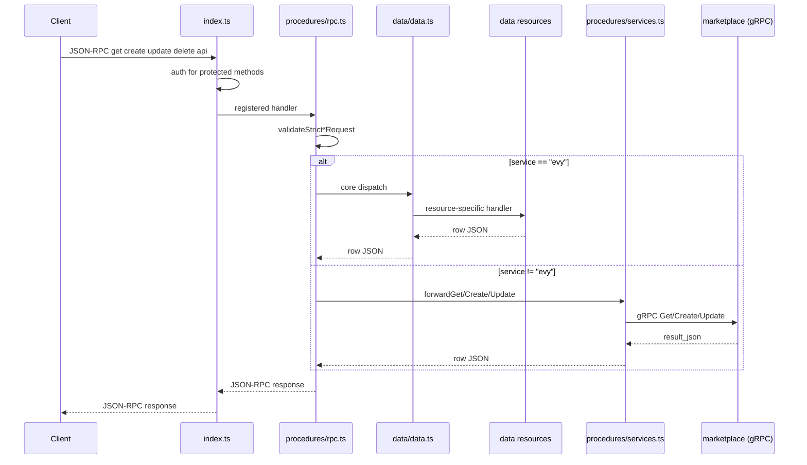
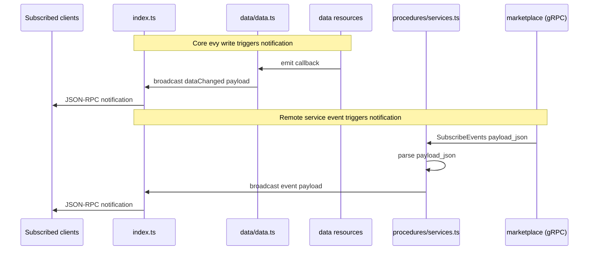
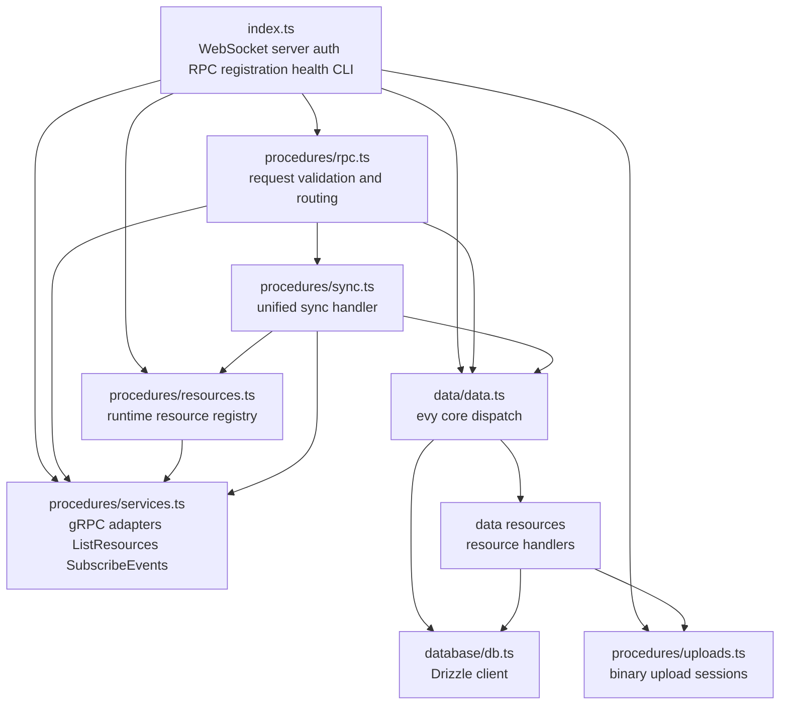

# EVY API

A JSON-RPC 2.0 WebSocket API gateway that routes data requests by `service` / `resource`, handles evy core resources directly, forwards non-evy services over gRPC, and pushes `dataChanged` notifications when data changes.

## Architecture

### Request dispatch

[`src/index.ts`](./src/index.ts) owns the WebSocket server, authentication, binary-frame handling, event broadcasting, and RPC registration. `resources`, `get`, and `api` are public read methods. `create`, `update`, `delete`, `sync`, and `cancelUpload` are protected (require a valid device token via `validateAuth`). Binary upload frames are also ignored unless they arrive on an authenticated WebSocket. Write params include `service`, `resource`, `data`, and an optional `filter` object for `create`; `update` and `delete` require `filter.id`.

- `service: "evy"` &mdash; routed by [`src/procedures/rpc.ts`](./src/procedures/rpc.ts) into [`src/data/data.ts`](./src/data/data.ts), then dispatched to resource-specific modules under [`src/data/resources/`](./src/data/resources/). Supported resources include `sdui`, `devices`, `organisations`, `services`, `providers`, and `files`.
- `service` ≠ `"evy"` (for example, `marketplace`) &mdash; [`src/procedures/rpc.ts`](./src/procedures/rpc.ts) calls `forwardGet`, `forwardCreate`, or `forwardUpdate` in [`src/procedures/services.ts`](./src/procedures/services.ts), which issue `Get`, `Create`, or `Update` on `evy.Service` and validate JSON responses. `delete` is currently limited to evy core resources.
- **`resources`** is a public RPC backed by [`src/procedures/resources.ts`](./src/procedures/resources.ts). It initializes the runtime registry by calling each non-evy service's `ListResources`, combines those names with generated evy core resource names, and returns `{ resources, resourcesByService }`.
- **`sync`** is a protected RPC that unifies startup data loading into a single call. Params are `{ lastSyncTime }` (ISO date-time). The response returns **all** changed rows across every registered syncable service (evy core SDUI/resources + external services) since that timestamp. When data changes, the response also includes the full resource registry. Response shape: `{ data: [{ service, resource, value }], resources?: { resources, resourcesByService } }`. Clients should store data rows under service-qualified keys (`evy:sdui`, `marketplace:items`, etc.) and apply the resource mapping for binding resolution when present. `devices` is excluded (auth-only).

Synchronous request/response path:


```mermaid
sequenceDiagram
    participant Client
    participant index as index.ts
    participant rpc as procedures/rpc.ts
    participant data as data/data.ts
    participant resource as data resources
    participant services as procedures/services.ts
    participant marketplace as marketplace (gRPC)

    Client->>index: JSON-RPC get create update delete api
    index->>index: auth for protected methods
    index->>rpc: registered handler
    rpc->>rpc: validateStrict*Request

    alt service == "evy"
        rpc->>data: core dispatch
        data->>resource: resource-specific handler
        resource-->>data: row JSON
        data-->>rpc: row JSON
    else service != "evy"
        rpc->>services: forwardGet/Create/Update
        services->>marketplace: gRPC Get/Create/Update
        marketplace-->>services: result_json
        services-->>rpc: row JSON
    end

    rpc-->>index: JSON-RPC response
    index-->>Client: JSON-RPC response
```

### Notifications

[`src/index.ts`](./src/index.ts) registers the `dataChanged` server event and emits standard JSON-RPC notifications with the following shape:

```json
{ "jsonrpc": "2.0", "method": "dataChanged", "params": { "service": "evy", "resource": "sdui", "operation": "create", "value": { /* row */ } } }
```


```mermaid
sequenceDiagram
    participant Client as Subscribed clients
    participant index as index.ts
    participant data as data/data.ts
    participant resource as data resources
    participant services as procedures/services.ts
    participant marketplace as marketplace (gRPC)

    Note over resource,index: Core evy write triggers notification
    resource->>data: emit callback
    data->>index: broadcast dataChanged payload
    index->>Client: JSON-RPC notification

    Note over marketplace,index: Remote service event triggers notification
    marketplace->>services: SubscribeEvents payload_json
    services->>services: parse payload_json
    services->>index: broadcast event payload
    index->>Client: JSON-RPC notification
```

### Internal module layout


```mermaid
flowchart TD
    index[index.ts<br/>WebSocket server auth RPC registration health CLI]
    rpc[procedures/rpc.ts<br/>request validation and routing]
    registry[procedures/resources.ts<br/>runtime resource registry]
    services[procedures/services.ts<br/>gRPC adapters ListResources SubscribeEvents]
    sync[procedures/sync.ts<br/>unified sync handler]
    uploads[procedures/uploads.ts<br/>binary upload sessions]
    data[data/data.ts<br/>evy core dispatch]
    resources[data resources<br/>resource handlers]
    db[database/db.ts<br/>Drizzle client]

    index --> rpc
    index --> registry
    index --> services
    index --> uploads
    index --> data
    rpc --> data
    rpc --> services
    rpc --> sync
    registry --> services
    sync --> data
    sync --> services
    sync --> registry
    data --> resources
    data --> db
    resources --> db
    resources --> uploads
```

- [`src/database/db.ts`](./src/database/db.ts) owns the Drizzle client and imports API tables directly from `types/generated/ts/db/schema.generated.ts`.
- [`src/data/data.ts`](./src/data/data.ts) owns evy core dispatch; resource-specific logic lives in [`src/data/resources/`](./src/data/resources/) (`sdui`, `devices`, `organisations`, `services`, `providers`, `files`).
- Upload sessions live in memory in [`src/procedures/uploads.ts`](./src/procedures/uploads.ts); [`src/data/resources/files.ts`](./src/data/resources/files.ts) persists binary file data and metadata.
- The schema comes from `types/schema/data/`, `types/schema/files/`, and `types/schema/rpc/` via `bun run types:generate`.
- Validators and the generated evy core registry are imported from `evy-types/validators`, `evy-types/rpcRequestHelpers`, and `evy-types/coreResources`.

### Shared contracts

Broader schema layout: [docs/evy/types.md § Sources](../docs/evy/types.md#sources). Commonly used paths:

| File | Purpose |
|------|---------|
| [`types/schema/service.proto`](../types/schema/service.proto) | `evy.Service` gRPC IDL implemented by every non-`evy` backend (`Get`, `Create`, `Update`, `ListResources`, `SubscribeEvents`) |
| [`types/schema/data/data.schema.json`](../types/schema/data/data.schema.json) | JSON Schema for `DATA_EVY_*` persistence rows, including file metadata |
| [`types/schema/files/file.schema.json`](../types/schema/files/file.schema.json) | Shared file metadata, binary response, upload chunk, and file-specific RPC param models |
| [`types/schema/sdui/evy.schema.json`](../types/schema/sdui/evy.schema.json) | `UI_Flow` / `UI_Page` / `UI_Row` contract |
| [`types/schema/rpc/*.schema.json`](../types/schema/rpc) | JSON-RPC params and responses for `resources`, `api`, `sync`, `get`, `create`, `update`, and `delete` |

## Prerequisites

- [Bun](https://bun.sh/) installed on your system
- PostgreSQL database (or use Docker Compose)

Copy [`.env.example`](../.env.example) to `../.env` (see comments there). API-relevant variables include:

```env
API_PORT=8000
DB_USER=evy
DB_PASS=evy
DB_PORT=5432
DB_DOMAIN=localhost
DB_EVY_DATABASE=evy
# Required for each non-evy service (dial target host:port for the API); see api/src/procedures/services.ts
# Local processes on the host: use 127.0.0.1. Docker Compose overrides use the service name `marketplace`.
MARKETPLACE_GRPC_HOST=127.0.0.1
MARKETPLACE_GRPC_PORT=8001
```

## Getting Started

### Installation

```bash
bun install
```

### Database Setup

Run migrations to set up the database schema:

```bash
bun run db:migrate
```

### Running the dev server with hot-reload

```bash
bun run dev
```

### Docker

```bash
docker build -t evy-api .
docker run -p 8000:8000 \
  -e DB_USER="user" \
  -e DB_PASS="password" \
  -e DB_PORT="5432" \
  -e DB_DOMAIN="host" \
  -e DB_EVY_DATABASE="evy" \
  -e MARKETPLACE_GRPC_HOST="marketplace" \
  -e MARKETPLACE_GRPC_PORT="8001" \
  evy-api
```

### Docker Compose

From the repo root: `docker compose up -d api` (same stack as [README § Development (with Docker Compose)](../README.md#development-with-docker-compose)). Optional API-only file: [`compose.yml`](./compose.yml) here (service `app`, `env_file` → root `.env`).

### Health checks

`bun run health` and `bun run health:seeded` invoke `src/index.ts --health` **without** `--env-file=../.env` (unlike `dev`, `start`, and `test:unit`). Export variables from the root `.env` in your shell, rely on Docker Compose `environment` / `env_file`, or run health checks from an environment where `DB_*` and `API_PORT` are already set.

## Available Scripts

| Script                 | Description                              |
| ---------------------- | ---------------------------------------- |
| `bun run dev`          | Start server with hot reload             |
| `bun run build`        | Build for production                     |
| `bun run start`        | Run migrations and start server          |
| `bun run health`       | Run the readiness check                  |
| `bun run health:seeded` | Run readiness check and require seed data |
| `bun run test:unit`    | Run API unit tests                       |
| `bun run test:e2e`     | Run API end-to-end tests                 |
| `bun run lint`         | Run Biome linter                         |
| `bun run format`       | Format files with Biome                  |
| `bun run db:generate`  | Generate migration from schema changes   |
| `bun run db:migrate`   | Apply pending migrations                 |
| `bun run db:push`      | Push schema directly (dev only)          |
| `bun run db:studio`    | Open Drizzle Studio UI                   |

## File Upload

### `files` EVY core resource

File metadata is stored in the `File` table (evy core, `service: "evy"`, `resource: "files"`). Metadata rows contain `id`, `createdAt`, and `updatedAt`. The shared file schema lives at [`types/schema/files/file.schema.json`](../types/schema/files/file.schema.json). Maximum upload size: 20 MB.

Binary data is stored at `api/public/files/{id}` with no extension or MIME-derived filename. Upload directories are excluded from git (see `api/.gitignore`). For production deployments, migrate to S3 or a CDN while keeping file IDs stable.

### Generic binary upload frame protocol

Binary payloads are staged as a sequence of authenticated binary WebSocket frames (not JSON-RPC). The API keeps staged chunks in memory until the upload is finalised with `create` or discarded with `cancelUpload`, so clients should finalise or cancel promptly. Each frame has the format:

```
[4-byte big-endian metadataLength][metadata JSON bytes][raw bytes]
```

The metadata JSON has the shape:

```json
{ "uploadId": "<uuid>", "index": 0, "byteOffset": 0, "byteLength": 12345 }
```

- `uploadId` — a client-generated UUID identifying the upload session. For file creation, this should be the future file id.
- `index` — zero-based sequential chunk index.
- `byteOffset` — byte offset of this chunk within the full upload.
- `byteLength` — byte length of the chunk data following the metadata.

Chunks must arrive in order: each session starts with `index: 0` and `byteOffset: 0`, then increments by one chunk and the received byte count. Mismatched index, offset, length, or uploads over 20 MB are rejected.

### Creating files

After staging the binary upload, create the file through the normal protected `create` RPC:

```json
{
  "service": "evy",
  "resource": "files",
  "filter": { "id": "<uploadId>" },
  "data": {
    "id": "<uploadId>",
    "createdAt": "2026-05-28T00:00:00.000Z",
    "updatedAt": "2026-05-28T00:00:00.000Z"
  }
}
```

`filter.id` is the uploaded binary id to consume. The API writes the binary to disk, creates metadata, and emits the normal `dataChanged` notification for `resource: "files"`. The server owns `createdAt` and `updatedAt` on insert, so client-supplied timestamps are only used to satisfy shared schema shape.

### Reading and syncing files

The generic `get` method supports `service: "evy"`, `resource: "files"` with optional `filter.id` or `filter.updatedAfter`. Responses are arrays of `{ id, createdAt, updatedAt, dataBase64 }`, ordered by `updatedAt` and `id`. Because `files` is an evy core resource, `sync` can also include changed files in the same response shape.

### RPCs

| Method | Auth | Description |
|--------|------|-------------|
| `create` | protected | For `service: "evy"`, `resource: "files"`, finalises a staged binary upload and creates file metadata. |
| `delete` | protected | For `service: "evy"`, `resource: "files"`, deletes file binary and metadata. Params include `filter: { id }`. Returns the deleted metadata row. |
| `cancelUpload` | protected | Discard an in-progress generic upload session. Params: `{ uploadId }`. Returns `{ ok: true }`. |
| `get` | public | For `service: "evy"`, `resource: "files"`, returns file metadata + base64 binary rows. Use `filter: { id }` to fetch a single file or `filter.updatedAfter` for incremental reads. |
