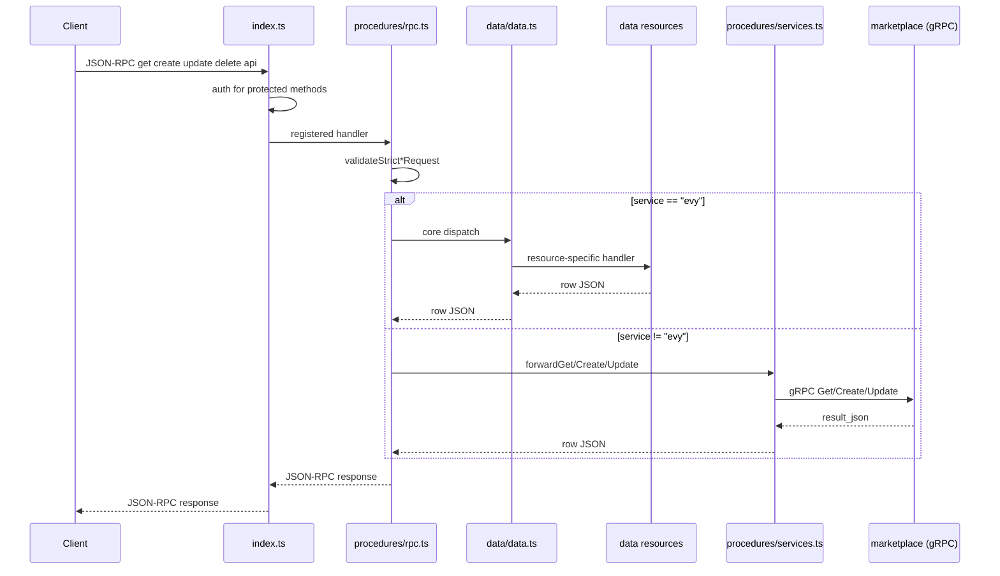
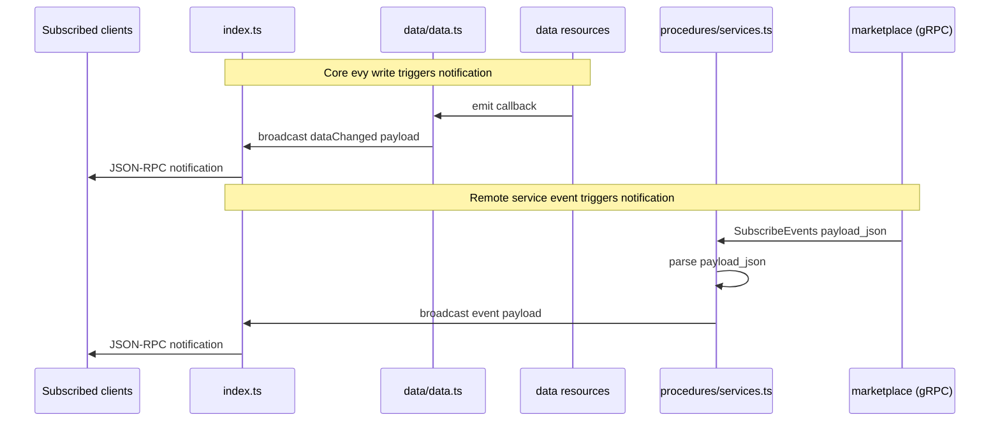

# EVY API

A JSON-RPC 2.0 WebSocket API gateway that routes data requests by `service` / `resource`, handles evy core resources directly, forwards non-evy services over gRPC, and pushes `dataChanged` notifications when data changes.

## Architecture

### Request dispatch

Incoming JSON-RPC messages are authenticated where required, validated, then dispatched based on `service`. Requests for `service: "evy"` are handled by evy core resource modules. All other services are forwarded to the appropriate backend over gRPC. Binary upload frames follow a separate path and are only accepted on authenticated connections.


```mermaid
sequenceDiagram
    participant Client
    participant index as index.ts
    participant rpc as procedures/rpc.ts
    participant data as data/data.ts
    participant resource as data resources
    participant services as procedures/services.ts
    participant marketplace as marketplace (gRPC)

    Client->>index: JSON-RPC get create update delete api
    index->>index: auth for protected methods
    index->>rpc: registered handler
    rpc->>rpc: validateStrict*Request

    alt service == "evy"
        rpc->>data: core dispatch
        data->>resource: resource-specific handler
        resource-->>data: row JSON
        data-->>rpc: row JSON
    else service != "evy"
        rpc->>services: forwardGet/Create/Update
        services->>marketplace: gRPC Get/Create/Update
        marketplace-->>services: result_json
        services-->>rpc: row JSON
    end

    rpc-->>index: JSON-RPC response
    index-->>Client: JSON-RPC response
```

### Notifications

The server emits `dataChanged` JSON-RPC notifications to all subscribed clients when data changes, both for evy core resources and remote service events:


```mermaid
sequenceDiagram
    participant Client as Subscribed clients
    participant index as index.ts
    participant data as data/data.ts
    participant resource as data resources
    participant services as procedures/services.ts
    participant marketplace as marketplace (gRPC)

    Note over resource,index: Core evy write triggers notification
    resource->>data: emit callback
    data->>index: broadcast dataChanged payload
    index->>Client: JSON-RPC notification

    Note over marketplace,index: Remote service event triggers notification
    marketplace->>services: SubscribeEvents payload_json
    services->>services: parse payload_json
    services->>index: broadcast event payload
    index->>Client: JSON-RPC notification
```

### Shared contracts

Broader schema layout: [docs/evy/data.md § Sources](../docs/evy/data.md#sources). Commonly used paths:

| File | Purpose |
|------|---------|
| [`types/schema/service.proto`](../types/schema/service.proto) | gRPC IDL implemented by every non-`evy` backend |
| [`types/schema/data/data.schema.json`](../types/schema/data/data.schema.json) | Persistence row schemas, including file metadata |
| [`types/schema/files/file.schema.json`](../types/schema/files/file.schema.json) | File metadata, binary response, and upload models |
| [`types/schema/sdui/evy.schema.json`](../types/schema/sdui/evy.schema.json) | `UI_Flow` / `UI_Page` / `UI_Row` contract |
| [`types/schema/rpc/*.schema.json`](../types/schema/rpc) | JSON-RPC params and responses for all RPC methods |

## Prerequisites

- [Bun](https://bun.sh/) installed on your system
- PostgreSQL database (or use Docker Compose)

Copy [`.env.example`](../.env.example) to `../.env` and follow the comments there.

## Getting Started

### Installation

```bash
bun install
```

### Database Setup

```bash
bun run db:migrate
```

### Running the dev server with hot-reload

```bash
bun run dev
```

### Docker

```bash
docker build -t evy-api .
```

All required env vars (database connection, gRPC hosts, etc.) must be provided at runtime. See the root [`.env.example`](../.env.example) for the full list.

### Docker Compose

From the repo root: `docker compose up -d api` (same stack as [README § Development (with Docker Compose)](../README.md#development-with-docker-compose)). Optional API-only file: [`compose.yml`](./compose.yml) here (service `app`, `env_file` → root `.env`).

### Health checks

```bash
bun run health
bun run health:seeded
```

Env vars must be exported in the shell or provided via Docker — they are not loaded from `.env` automatically.

## Available Scripts

| Script                  | Description                              |
| ----------------------- | ---------------------------------------- |
| `bun run dev`           | Start server with hot reload             |
| `bun run build`         | Build for production                     |
| `bun run start`         | Run migrations and start server          |
| `bun run health`        | Run the readiness check                  |
| `bun run health:seeded` | Run readiness check and require seed data |
| `bun run test:unit`     | Run API unit tests                       |
| `bun run test:e2e`      | Run API end-to-end tests                 |
| `bun run lint`          | Run Biome linter                         |
| `bun run format`        | Format files with Biome                  |
| `bun run db:generate`   | Generate migration from schema changes   |
| `bun run db:migrate`    | Apply pending migrations                 |
| `bun run db:push`       | Push schema directly (dev only)          |
| `bun run db:studio`     | Open Drizzle Studio UI                   |

## File Upload

Files are stored at `api/public/files/{id}` (excluded from git). File metadata is an evy core resource (`service: "evy"`, `resource: "files"`). Maximum upload size is 20 MB. For production deployments, migrate to S3 or a CDN while keeping file IDs stable.
