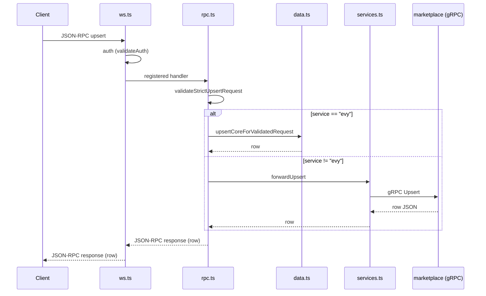
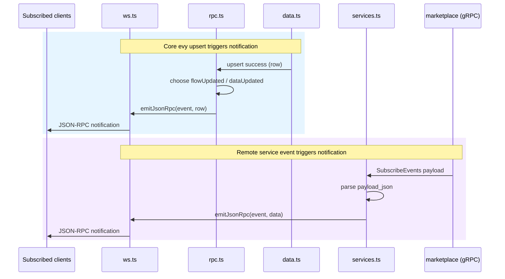
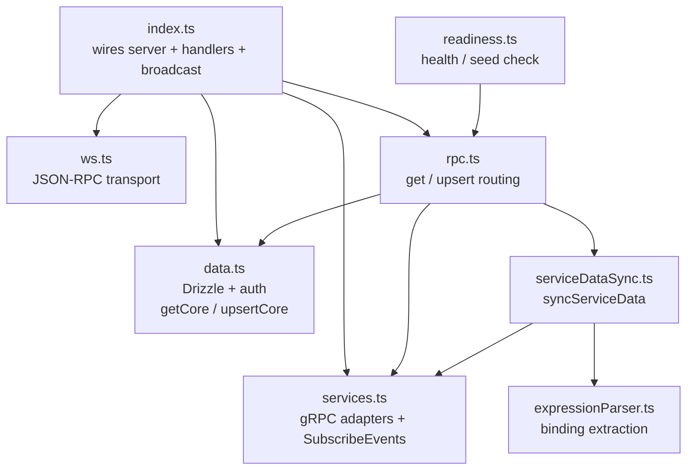

# EVY API

Main API for EVY. A JSON-RPC 2.0 WebSocket server (via [`rpc-websockets`](https://github.com/elpheria/rpc-websockets)) that handles `service: "evy"` in-process (SDUI flows and core tables), forwards other services over gRPC, and pushes real-time `dataUpdated` / `flowUpdated` notifications to connected clients.

Monorepo setup (Compose, seeding, local Bun): [README § Running Services](../README.md#running-services).

## Architecture

### System view

High-level diagram (iOS / web / API / marketplace / Postgres): [README § Architecture at a glance](../README.md#architecture-at-a-glance).

The API is the only public edge for iOS and the web builder. Requests are validated against [`types/schema/rpc/`](../types/schema/rpc) and routed by `service` + `resource` in [`src/rpc.ts`](./src/rpc.ts): `service === "evy"` goes to [`src/data.ts`](./src/data.ts); any other registered service uses [`src/services.ts`](./src/services.ts) to call gRPC. Every non-`evy` service must declare `${SERVICE}_GRPC_HOST` and `${SERVICE}_GRPC_PORT` (see `SERVICE_VALUES` in generated types / [`src/services.ts`](./src/services.ts)).

### Request dispatch

`get` is public, `upsert` is protected (requires a valid device token via `validateAuth`). Params include `service`, `resource`, optional `filter.id`, and for `upsert` a `data` object (see JSON Schemas under `types/schema/rpc/`).

- `service: "evy"` &mdash; handled entirely in [`src/data.ts`](./src/data.ts). Supported resources include `sdui` (flows / `flow` table), `devices` (via auth only for writes), `organisations`, `services`, and `providers` (typed catalog tables). There is no generic `evy` “data” table routed through `services.ts`.
- `service` ≠ `"evy"` (e.g. `marketplace`) &mdash; [`src/rpc.ts`](./src/rpc.ts) calls `forwardGet` / `forwardUpsert` in [`src/services.ts`](./src/services.ts), which issue `Get` / `Upsert` on `evy.Service` and validate JSON responses.
- `syncServiceData` is a protected RPC for client-side service cache refresh. Params are `{ service, lastSyncTime }`, where `service` is a syncable non-`evy` service and `lastSyncTime` is an ISO date-time. The API forwards one `get` per service resource with `filter.updatedAfter = lastSyncTime`, omits empty result arrays, and returns `{ data: [{ service, resource, value }] }`. Clients should persist synced rows with service-qualified keys like `marketplace:items`; SDUI bindings such as `{items}` may resolve through client fallback, while `{$api:...}`, `{$local:...}`, and `{$datum:...}` are client-side binding namespaces rather than backend flow state. The API stores action strings without executing them, but its service-sync parser extracts resource keys from braced expressions and action function arguments.

Synchronous request/response path:


```mermaid
sequenceDiagram
    participant Client
    participant ws as ws.ts
    participant rpc as rpc.ts
    participant data as data.ts
    participant services as services.ts
    participant marketplace as marketplace (gRPC)

    Client->>ws: JSON-RPC upsert
    ws->>ws: auth (validateAuth)
    ws->>rpc: registered handler
    rpc->>rpc: validateStrictUpsertRequest

    alt service == "evy"
        rpc->>data: upsertCoreForValidatedRequest
        data-->>rpc: row
    else service != "evy"
        rpc->>services: forwardUpsert
        services->>marketplace: gRPC Upsert
        marketplace-->>services: row JSON
        services-->>rpc: row
    end

    rpc-->>ws: JSON-RPC response (row)
    ws-->>Client: JSON-RPC response (row)
```

Notification fan-out paths:


```mermaid
sequenceDiagram
    participant Client as Subscribed clients
    participant ws as ws.ts
    participant rpc as rpc.ts
    participant data as data.ts
    participant services as services.ts
    participant marketplace as marketplace (gRPC)

    rect rgb(230, 245, 255)
    Note over data,ws: Core evy upsert triggers notification
    data->>rpc: upsert success (row)
    rpc->>rpc: choose flowUpdated / dataUpdated
    rpc->>ws: emitJsonRpc(event, row)
    ws->>Client: JSON-RPC notification
    end

    rect rgb(245, 235, 255)
    Note over marketplace,ws: Remote service event triggers notification
    marketplace->>services: SubscribeEvents payload
    services->>services: parse payload_json
    services->>ws: emitJsonRpc(event, data)
    ws->>Client: JSON-RPC notification
    end
```

### Real-time notifications

`ws.ts` registers two server events (`dataUpdated`, `flowUpdated`) and ships a custom `emitJsonRpc` helper because `rpc-websockets` emits a non-standard wire shape that `JsonRPC.swift` on iOS cannot parse. All pushed frames therefore use standard JSON-RPC 2.0:

```json
{ "jsonrpc": "2.0", "method": "dataUpdated", "params": { /* row */ } }
```

- [`src/index.ts`](./src/index.ts) creates a `broadcast` callback wrapping `emitJsonRpc` and injects it into `rpc` and `services` at startup.
- Successful `evy` upserts invoke the broadcast callback from [`src/rpc.ts`](./src/rpc.ts): `flowUpdated` when `resource === "sdui"`, otherwise `dataUpdated`.
- Remote services emit named events on `evy.Service.SubscribeEvents`; [`src/services.ts`](./src/services.ts) parses `payload_json` and forwards them via the same broadcast callback (reconnect with exponential backoff).
- The shared [`src/broadcast.ts`](./src/broadcast.ts) defines the `BroadcastFn` type contract, decoupling `rpc` and `services` from the WebSocket layer.

### Internal module layout


```mermaid
flowchart TD
    index[index.ts<br/>wires server + handlers + broadcast]
    ws[ws.ts<br/>JSON-RPC transport]
    rpc[rpc.ts<br/>get / upsert routing]
    data[data.ts<br/>Drizzle + auth<br/>getCore / upsertCore]
    services[services.ts<br/>gRPC adapters + SubscribeEvents]
    serviceDataSync[serviceDataSync.ts<br/>syncServiceData]
    expressionParser[expressionParser.ts<br/>binding extraction]
    readiness[readiness.ts<br/>health / seed check]

    index --> ws
    index --> rpc
    index --> data
    index --> services
    rpc --> data
    rpc --> services
    rpc --> serviceDataSync
    serviceDataSync --> services
    serviceDataSync --> expressionParser
    readiness --> rpc
```

- `data.ts` owns the Drizzle client and imports API tables directly from `types/generated/ts/db/schema.generated.ts`.
- The schema comes from `types/schema/data/` via `bun run types:generate`.
- Validators are imported directly from `evy-types/validators` and `evy-types/rpcRequestHelpers` (no local wrapper file).

### Shared contracts

Broader schema layout: [docs/evy/types.md § Sources](../docs/evy/types.md#sources). Commonly used paths:

| File | Purpose |
|------|---------|
| [`types/schema/service.proto`](../types/schema/service.proto) | `evy.Service` gRPC IDL implemented by every non-`evy` backend |
| [`types/schema/data/data.schema.json`](../types/schema/data/data.schema.json) | JSON Schema for `DATA_EVY_*` rows |
| [`types/schema/sdui/evy.schema.json`](../types/schema/sdui/evy.schema.json) | `UI_Flow` / `UI_Page` / `UI_Row` contract |
| [`types/schema/rpc/*.schema.json`](../types/schema/rpc) | `GetRequest` / `UpsertRequest` / `GetResponse` contracts |

## Prerequisites

- [Bun](https://bun.sh/) installed on your system
- PostgreSQL database (or use Docker Compose)

Copy [`.env.example`](../.env.example) to `../.env` (see comments there). API-relevant variables include:

```env
API_PORT=8000
DB_USER=evy
DB_PASS=evy
DB_PORT=5432
DB_DOMAIN=localhost
DB_EVY_DATABASE=evy
# Required for each non-evy service (dial target host:port for the API); see api/src/services.ts
# Local processes on the host: use 127.0.0.1. Docker Compose overrides use the service name `marketplace`.
MARKETPLACE_GRPC_HOST=127.0.0.1
MARKETPLACE_GRPC_PORT=8001
```

## Getting Started

### Installation

```bash
bun install
```

### Database Setup

Run migrations to set up the database schema:

```bash
bun run db:migrate
```

### Running the dev server with hot-reload

```bash
bun run dev
```

### Docker

```bash
docker build -t evy-api .
docker run -p 8000:8000 \
  -e DB_USER="user" \
  -e DB_PASS="password" \
  -e DB_PORT="5432" \
  -e DB_DOMAIN="host" \
  -e DB_EVY_DATABASE="evy" \
  -e MARKETPLACE_GRPC_HOST="marketplace" \
  -e MARKETPLACE_GRPC_PORT="8001" \
  evy-api
```

### Docker Compose

From the repo root: `docker compose up -d api` (same stack as [README § Development (with Docker Compose)](../README.md#development-with-docker-compose)). Optional API-only file: [`compose.yml`](./compose.yml) here (service `app`, `env_file` → root `.env`).

### Health checks

`bun run health` and `bun run health:seeded` invoke `src/readiness.ts` **without** `--env-file=../.env` (unlike `dev`, `start`, and `test`). Export variables from the root `.env` in your shell, rely on Docker Compose `environment` / `env_file`, or run readiness from an environment where `DB_*` and `API_PORT` are already set.

## Available Scripts

| Script                 | Description                              |
| ---------------------- | ---------------------------------------- |
| `bun run dev`          | Start server with hot reload             |
| `bun run build`        | Build for production                     |
| `bun run start`        | Run migrations and start server          |
| `bun run health`       | Run the readiness check                  |
| `bun run health:seeded` | Run readiness check and require seed data |
| `bun run test`         | Run API unit and integration tests       |
| `bun run test:e2e`     | Run API end-to-end tests                 |
| `bun run lint`         | Run Biome linter                         |
| `bun run format`       | Format files with Biome                  |
| `bun run db:generate`  | Generate migration from schema changes   |
| `bun run db:migrate`   | Apply pending migrations                 |
| `bun run db:push`      | Push schema directly (dev only)          |
| `bun run db:studio`    | Open Drizzle Studio UI                   |
