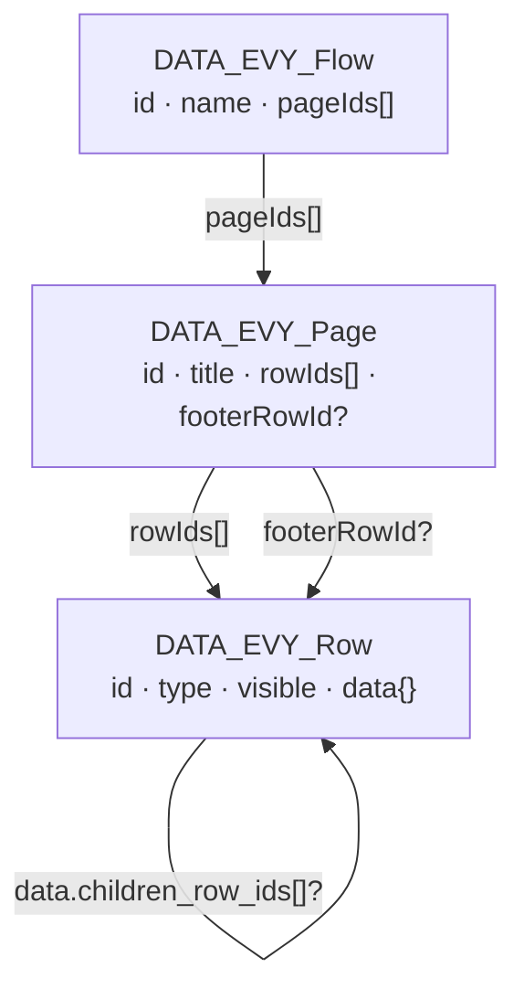
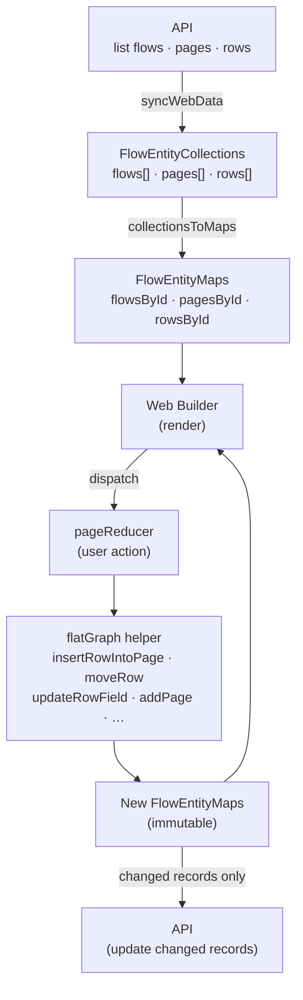
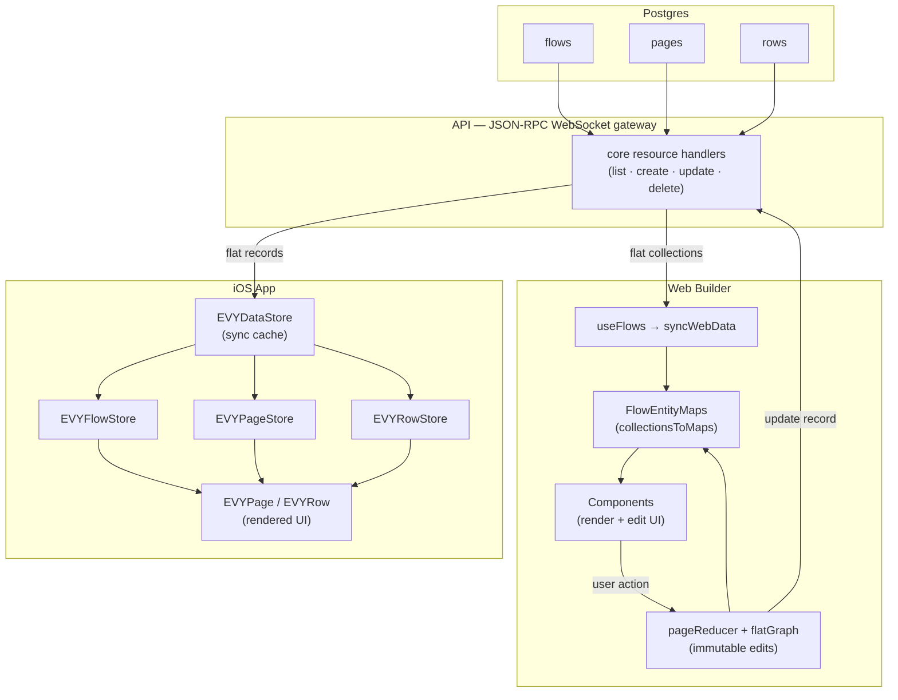

# Server-driven UI

All UI in EVY is server-driven. On the API service we store SDUI as flat `flows`, `pages`, and `rows` resources for all services and UX. Clients assemble those persisted records into the nested `UI_Flow` shape below when rendering, and decompose nested edits back into flat records when saving.

All attributes in SDUI are strings, and most are required.

## Flow

Flows represent a full user journey (eg: creating an item, placing an order, etc). They are needed to correctly submit data from a set of pages with a single end state.

The canonical shape matches `types/schema/sdui/evy.schema.json`:

```
{
    "id": "uuid",
    "name": "string",
    "pages": [PAGE]
}
```

## Page

A page is an single screen in a flow, for example step 1 in a booking flow.

```
{
    "id": "uuid",
    "title": "string",   // Shown in the navbar
    "rows": [ROW],
    "footer": ROW        // Optional; shown as sticky footer
}
```

## Row

Rows are what are put into pages. They are the building block of the EVY server-driven UI framework

-   All attributes can include:
    -   variables surrounded with curly braces: "Hello {name}, how are you?"
    -   inline icons as [Lucide](https://lucide.dev/icons) names in kebab-case, wrapped in double colons: "EVY ::image-plus:: is the best!"
-   [ x ]
    -   Denotes a type array of x
-   Objects and arrays
    -   When objects or arrays are interpolated (e.g. `{[resource_id].tags}`), the UI runtime resolves the binding to structured data (e.g. a JSON array of tag objects) before rendering—use the schema and client behavior for the exact shape, not a hand-written JSON fragment in the flow string.

```
{
    "id": "uuid",
    "type": "Button" | "Calendar" | "ColumnContainer" | "Heading" | "Text" | ... ,

    // Required. Header of the row; empty string means no header.
    "title": "string",
    // Row-type-specific attributes live at the row root, e.g. label, text, subtitle, placeholder, format, etc.
    "label": "string",
    "text": "string",
    // Layout: "children" (array of rows), "child" (single row), "segments" (array of strings).
    // Optional array of children rows to display
    "children": [ROW],
    // Optional single child row to display
    "child": ROW,

    // Where the row reads option/list/entity data from (required string; use "" if unused).
    "source": "string",
    // Where input data is stored in a draft. Use canonical resource IDs such as "{[resource_id].title}".
    "destination": "string",

    // Visibility predicate. Use "true" for always shown, or a condition expression to render only when it evaluates to true.
    "visible": "string",

    // Actions are required on every row and default to an empty array
    "actions": [{
        "condition": "{length(title) > 0}",
        "false": "{highlight_required(title)}",
        "true": "{create([service_id],[resource_id])}"
    }]
}
```

### Actions

Each row has an `actions` attribute which is an array of `UI_RowAction` objects that can trigger various actions if a condition is met or not met.

#### Conditions

- Empty `condition` — treated as always true (the `true` branch is taken unless you rely on client-specific rules).
- Operators: `==`, `!=`, `>`, `<`, `>=`, `<=`
- AND: join comparisons with `&&` inside the braces:
	`{length(title) > 0 && price.value >= 1}`
- OR: join comparisons with `||` inside the braces:
	`{count(pickup_selection) > 0 || count(delivery_selection) > 0 || count(shipping_destination_areas) > 0}`
- Grouping: use parentheses to control precedence:
	`{(length(title) > 0 && price.value >= 1) || override == true}`
- Boolean literals `true` and `false` are valid as standalone conditions or operands.
- Condition helpers (used like functions in the expression):
	- `count(var)` — number of elements in a list/array, e.g. `{count(photo_ids) > 0}`
	- `length(var)` — number of characters in a string, e.g. `{length(title) > 0}`

#### Branches (`true` / `false`)

Each branch is a string. Empty string means "do nothing" for that branch.

Action branches **must** be wrapped in curly braces to be executed: `{functionName(arg1, arg2, ...)}`. A bare function name without braces (e.g. `close` or `close()`) is treated as inert text and will not trigger any action.

Supported action functions:

| Function | Meaning |
| -------- | ------- |
| `close()` | Close current UI, e.g. `{close()}` |
| `create(service_id, resource_id)` | Submit / create domain entity, e.g. `{create([service_id],[resource_id])}` |
| `navigate(flowId, pageId, queryParams?)` | Go to a page within a flow, e.g. `{navigate(flowId, pageId)}`. Pass query params as the optional third argument using a plain-text query object, e.g. `{navigate(flowId, pageId, {id: $datum.id})}`. |
| `highlight_required(field)` | Mark a field as required / show validation, e.g. `{highlight_required(title)}` |

Note that the web builder does not execute actions; it only stores these strings and displays mocks.

#### Examples (from `docs/services/service_sdui.json`)

Validate several fields with empty `true` steps, then navigate:

```json
{
	"condition": "{length(title) > 0}",
	"false": "{highlight_required(title)}",
	"true": ""
}
```

Final “Next” after validations:

```json
{
	"condition": "",
	"false": "",
	"true": "{navigate([flow_id],[page_id])}"
}
```

Navigate with query params (selects an entity from synced data):

```json
{
	"condition": "",
	"false": "",
	"true": "{navigate([flow_id],[page_id],{id: $datum.id})}"
}
```

OR condition with navigate on success:

```json
{
	"condition": "{count(pickup_selection) > 0 || count(delivery_selection) > 0 || count(shipping_destination_areas) > 0}",
	"false": "{highlight_required(pickup_selection)}",
	"true": "{navigate([flow_id],[another_page_id])}"
}
```

Submit:

```json
{
	"condition": "",
	"false": "",
	"true": "{create([service_id],[resource_id])}"
}
```

---

## Architecture: flat storage model

Flows, pages, and rows are stored as three independent database tables and transferred as flat record collections. Neither the API nor the transport layer embeds nested objects — clients assemble the tree in memory.

### Entity relationships

Each entity references others by ID only. Rows can nest arbitrarily deep via two optional link fields stored inside `data`:



### flatGraph — web builder mutation helpers

`flatGraph.ts` exposes a set of pure, immutable helpers that take a `FlowEntityMaps` snapshot (three ID-keyed lookup maps) and return a new snapshot. No entity is ever mutated in place. The web builder's `pageReducer` dispatches every user action through one of these helpers, then syncs only the changed records back to the API.



---

## iOS and Web: SDUI data flow

Both clients connect to the same JSON-RPC WebSocket gateway. The API returns flows, pages, and rows as independent flat collections. Each client builds its own in-memory representation:

- **Web builder** converts records to ID-keyed maps and uses `flatGraph.ts` for all edits. Changes are written back to the API as individual record updates.
- **iOS app** stores records in `EVYDataStore` and resolves them on demand through typed store accessors (`EVYFlowStore`, `EVYPageStore`, `EVYRowStore`). Container rows follow `child_row_id` / `children_row_ids` links at render time.


