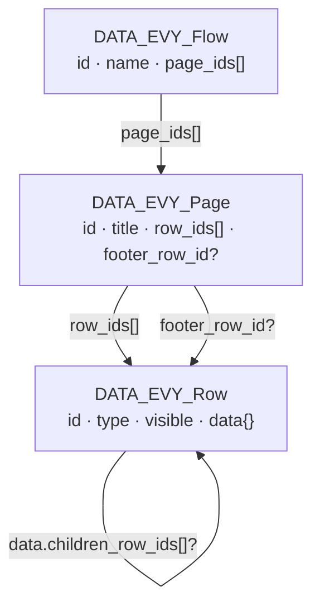
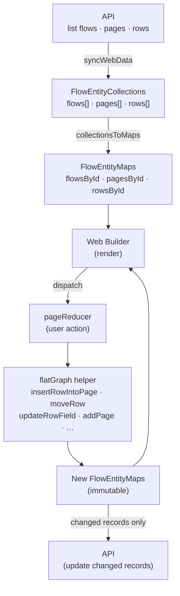
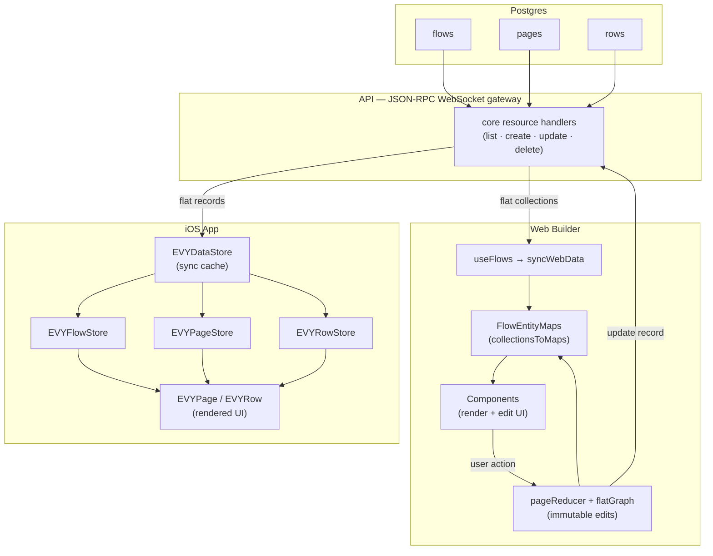

# Server-driven UI

All UI in EVY is server-driven. On the API service we store SDUI as flat `flows`, `pages`, and `rows` resources for all services and UX. Clients assemble those persisted records into the nested `UI_Flow` shape below when rendering, and decompose nested edits back into flat records when saving.

All attributes in SDUI are strings, and most are required.

Row types are defined as standard JSON Schema files in
[`types/schema/sdui/definitions/*.schema.json`](../../types/schema/sdui/definitions/). Each row
schema combines the common `UI_RowBase` shape from
[`types/schema/sdui/evy.schema.json`](../../types/schema/sdui/evy.schema.json) with row-specific
properties, a unique `type.const` discriminator, and a top-level `triggers` block declaring
which action triggers that row type supports and whether each is `"required"` or `"optional"`
(see [Trigger matrix](#trigger-matrix) below). See
[`calendar.schema.json`](../../types/schema/sdui/definitions/calendar.schema.json) for an
example.

## Flow

Flows represent a full user journey (eg: creating an item, placing an order, etc). They are needed to correctly submit data from a set of pages with a single end state.

The canonical shape matches [`types/schema/sdui/evy.schema.json`](../../types/schema/sdui/evy.schema.json):

```
{
    "id": "uuid",
    "name": "string",
    "pages": [PAGE]
}
```

## Page

A page is an single screen in a flow, for example step 1 in a booking flow.

```
{
    "id": "uuid",
    "name": "string",    // Required. Developer-facing page name.
    "title": "string",   // Shown in the navbar
    "rows": [ROW],
    "footer": ROW        // Optional; shown as sticky footer
}
```

## Row

Rows are what are put into pages. They are the building block of the EVY server-driven UI framework

-   All attributes can include:
    -   variables surrounded with curly braces: "Hello {name}, how are you?"
    -   inline icons as [Lucide](https://lucide.dev/icons) names in kebab-case, wrapped in double colons: "EVY ::image-plus:: is the best!"
    -   Builder consequence: in text attributes the web builder resolves ids to named chips **only inside `{…}`**, because everything outside braces is literal. Binding attributes (`source`, `destination`, `secondary`) and `visible` are braced template fields — identifiers inside `{…}` are data paths. Map values inside action expression arguments follow [value-position](./actions.md#value-position) rules (bare = literal, `{expr}` = resolve). Resource references are dotted (`evy.messages`, `marketplace.items`); the dot is the discriminator, so prose like "No messages found" no longer collides with a resource reference.
-   [ x ]
    -   Denotes a type array of x
	-   Objects and arrays
	    -   When objects or arrays are interpolated (e.g. `{marketplace.items.dimensions}`), the UI runtime resolves the binding to structured data before rendering—use the schema and client behavior for the exact shape, not a hand-written JSON fragment in the flow string.

```
{
    "id": "uuid",
    "type": "button" | "calendar" | "horizontal_container" | "heading" | "text" | ... ,

    // Required. Developer-facing row name.
    "name": "string",
    // Required. Header of the row; empty string means no header.
    "title": "string",
    // Row-type-specific attributes live at the row root, e.g. label, text, subtitle, placeholder, value, etc.
    "label": "string",
    "text": "string",

    // Structural relationships (persisted as IDs in row data — see data.md):
    // sheet — optional on every row; overlay content presented via a `show` action
    // child — Search only; one result-row template (not a sheet)
    // children — static nested rows on container types
    // segments — TabContainer tab labels, paired with static children entries
    "sheet": ROW,
    "children": [ROW],
    "child": ROW,

    // Binding fields (only on row types that declare them — see table below):
    // source — where the row reads data (display text, options, collections, or location objects)
    // destination — where writes go; may be a plain path or an object template such as "{item.price: {value: $datum, currency: \"AUD\"}}"
    // secondary — greyed-out secondary data (Calendar only)
    // value — datum display template for option rows, e.g. "{formatCurrency($datum.price)}"
    //
    // Optional initial value for editable rows (Dropdown, Input, TextArea, InlinePicker only).
    // Seeded into the destination draft as soon as the page/row is activated, so untouched
    // defaults are submitted. Existing destination data or an existing draft always wins.
    // initial: "string",

    // Visibility predicate. Use "true" for always shown, or a condition expression to render only when it evaluates to true.
    "visible": "string",

    // Actions are required on every row (default {}). Each trigger holds an ordered list of UI_RowAction.
    "actions": {
        "tap": [{
            "condition": "{length(title) > 0}",
            "false": "{highlight_required(title)}",
            "true": "{create(marketplace.items,submit)}"
        }]
    }
}
```

#### Row relationships

Every row may declare an optional nested `sheet` row. At runtime, a `show` action presents that stored row (or any other row ID loaded in the client) in a sheet overlay. The sheet root row's `title` is the sheet header and is live-interpolated when it contains expressions; put confirmation headings on the sheet root, not on nested rows inside it.

`Search` is the only row type that may declare `child`. That `child` is a **result template**: the iOS app renders one instantiated copy per search result. It is not opened with `show`. A Search row may own both `child` and `sheet` independently.

`VerticalContainer`, `HorizontalContainer`, and `TabContainer` support static `children` (and `TabContainer` uses `segments` paired with those children). Dynamic `source` + per-item `child` templates are not supported; collection-driven layouts must use static structure or row types that bind their own `source`.

**Web builder:** Secondary builder pages edit a row's optional `sheet` only. For Search, the configured `child` template renders **once** inline directly under the search input as a layout sample—it is not a live search and does not mirror API results. The loading spinner and `no_results` empty-state text described below are runtime-only behavior and are not previewed in the builder. When you add or edit a Show action, the row argument defaults to the currently configured row's `sheet` row ID when one exists; you can pick any row from any loaded flow/page instead. Show requires an explicit row ID—a `show` with no row id is not a valid invocation.

#### Row binding fields

`source`, `destination`, `secondary`, and datum display `value` are row-type-specific — do not add them to rows that do not declare them in the schema.

| Row type | `source` | `destination` | `secondary` | `value` | Notes |
| --- | --- | --- | --- | --- | --- |
| `Input`, `TextArea` | yes | yes | no | no | Display reads `source`; writes pass raw text to `destination`. Optional `initial` seeds literal text into the draft on activation. |
| `Dropdown`, `InlinePicker` | yes | yes | no | yes | `source` = options; `value` = `$datum` display template; selection writes raw datum to `destination`. Optional `initial` seeds the default selection — a single option identifier for `Dropdown`, and a one-element identifier array for `InlinePicker`. |
| `Search` | yes | yes | no | no | `destination` stores the selected raw datum, stripping external `id` and merging over any existing draft so omitted keys (e.g. instructions) are preserved. Optional `child` is the search **result template** only (not a sheet). Optional `sheet` uses the universal overlay relationship. Optional `no_results` text renders under the search input in place of the result list once a search completes with zero results (iOS shows a spinner while an API-backed search is in flight). A blank/absent `placeholder` is **list-only mode**: no text input is shown, and `no_results` appears for an empty local source even with no query. |
| `Calendar` | yes | yes | yes | no | `source` = main timeslots to display (same binding as `destination`); `destination` = edited selection; `secondary` = greyed background slots. |
| `TimeslotPicker` | yes | yes | no | no | Single selected timeslot string in `destination`. Optional `sheet` for confirmation overlays via a `show` action. |
| `SelectPhoto` | yes | yes | no | no | `source` = shown images; `destination` = written image IDs. |
| `TextSelect` | yes | yes | no | no | `source` = current selected state; `destination` = write target. |
| `PhotoGallery`, `Map`, `VerticalContainer`, `HorizontalContainer`, `TabContainer`, `InputList` | yes | no | no | no | Read-only or collection `source`. Containers render static `children` only (`TabContainer`: `segments` paired with `children`). Optional `sheet` on any row type. |
| `Button`, `Text`, `TextAction`, `Heading` | no | no | no | no | `Button` accepts optional `style` `"primary"` (default) or `"danger"` (red on iOS). Any row type may attach optional `sheet`; `TextAction` commonly pairs with a `show` action. |

Formatted vs raw: the runtime resolves `source` for display (including `{formatCurrency(...)}` expressions) and exposes raw values for writes. `destination` may be a plain data path or an object template such as `{item.price: {value: $datum, currency: "AUD"}}` — writes substitute the user's typed or selected value for `$datum`. See [formatting.md](./formatting.md) for formatter and destination template reference.

### Initial values

`Dropdown`, `Input`, `TextArea`, and `InlinePicker` accept an optional `initial` string. When the row becomes part of the active page, its `initial` value is written to the destination draft immediately, so that:

- the default is visible before the user edits the row;
- submitting without editing still includes the default.

Value meaning per control:

- `Input` and `TextArea` — literal text.
- `Dropdown` — the selected option identifier, matching what single-selection controls already write.
- `InlinePicker` — one selected option identifier, stored as a one-element identifier array (matching the control's existing destination shape). An absent or empty `initial` keeps the existing empty-array bootstrap.

Precedence: concrete destination data > an existing draft (including a prior user edit) > `initial` > the row type's existing empty bootstrap value. Reappearing or re-rendering a row never restores `initial` over a user change.

Object-template destinations (e.g. `{item.price: {value: $datum, currency: "AUD"}}`) transform an `initial` value in the same way as an explicit user edit, so the seeded draft has the same structured shape.

### Actions

Each row has an `actions` attribute: an object keyed by **trigger** name. Each trigger maps to an ordered list of `UI_RowAction` objects (condition / `true` / `false` branches). Supported triggers in this release are `tap`, `delete`, `tap-row`, `tap-column`, `swipe-left`, and `submit`. The `submit` trigger runs when a row's typed value is committed (return key or blur, after the destination write). It is available on `Input` and `TextArea` only.

```jsonc
"actions": {
  "tap": [{ "condition": "", "false": "", "true": "{close()}" }],
  "submit": [{ "condition": "", "false": "", "true": "{close()}" }],
  "delete": [{ "condition": "", "false": "", "true": "{delete_photo()}" }],
  "tap_row": [{ "condition": "", "false": "", "true": "{select($datum)}" }],
  "tap_column": [{ "condition": "", "false": "", "true": "{select($datum)}" }],
  "swipe_left": [{ "condition": "", "false": "", "true": "{show(sheetId)}" }]
}
```

An empty object `{}` is the canonical “no actions” state (do not use `{"tap": []}`). The iOS client treats a missing trigger key the same as an empty list.

The **shape** of `actions` is validated by the API on every `create`/`update` of a row: only the six trigger names are accepted, each must map to a list, and each entry must have exactly `condition`, `true`, and `false`. A malformed shape is rejected at write time with the offending path (e.g. `/data/actions/tap/0`) rather than being stored and then silently dropped when a client fails to decode the row. Branch contents are validated too: a branch is either the empty string or a single inline action expression `{fn(…)}` per [`action.schema.json`](../../types/schema/sdui/action.schema.json); the shared `parseActionExpression` parser rejects unknown functions, wrong argument counts, and malformed object literals at write time.

See [actions.md](./actions.md) for the reference on every action function (`create`, `update`, `show`, `select`, `navigate`, …).

#### Trigger matrix

Which triggers each row type supports, and whether they're required, is declared per row type
in its `triggers` block in [`types/schema/sdui/definitions/*.schema.json`](../../types/schema/sdui/definitions/)
(e.g. `calendar.schema.json` declares `tap`, `tap_row`, and `tap_column` all `"required"`). This
is generated into `SDUI_ROW_TRIGGERS` in
[`types/generated/ts/sdui/definitions.generated.ts`](../../types/generated/ts/sdui/definitions.generated.ts)
and enforced in `validateUiFlow` (`types/validators.ts`) — a row with actions on an
undeclared trigger, or missing actions on a required trigger, is rejected at write time. The web
builder shows a required badge and warning when a required trigger has no actions but still
allows saving.

All action functions dispatch through a single client-side action channel; navigation (`navigate`, `close`) and non-navigation effects (`create`, `highlight_required`, `select`, `copy_to_clipboard`, `select_photo`, `delete_photo`, `expand_photo`, `expand_text`) are handled by the same runner. **Which list runs** depends on the trigger: row tap gestures and control-specific taps use `actions.tap`; value commit on `Input` and `TextArea` uses `actions.submit`; the `SelectPhoto` remove control uses `actions.delete`; Calendar day headers use `actions.tap-column` and time-axis labels use `actions.tap-row`; swipe-to-reveal on Heading/Input/ListItem/Text uses `actions.swipe-left`.

For row types that handle their own interactive elements (`SelectPhoto`, `TextExpand`, `TextSelect`, `PhotoGallery`, `TabContainer`, `TimeslotPicker`, `Calendar`, `InlinePicker`, `Search`), behaviour on **tap** comes only from `actions.tap`. An empty `tap` list means those taps do nothing. `Input` and `TextArea` use the generic whole-row tap path for `actions.tap` (the embedded text field still consumes taps on the field to begin editing). Calendar axis headings similarly run only `actions.tap-row` / `actions.tap-column`; empty axis triggers mean those headings do nothing.

#### Swipe (`swipe-left`)

On iOS, Heading, Input, ListItem, and Text rows with a non-empty `swipe-left` action list become swipeable (Mail-style trailing reveal). Dragging left reveals a single button (blue by default); releasing past the reveal threshold snaps open, and a fuller swipe executes immediately. Tapping the revealed button runs `actions.swipe-left` **in order with the row's datum** and closes the row. Only one row stays open at a time; tapping open content closes without firing `tap`. Empty or absent `swipe-left` means no swipe affordance.

Optional **`swipe_label`** (Heading, Input, ListItem, Text only) sets the revealed button content as EVY text (icons like `::check::`, interpolations, etc.). When omitted or blank, iOS shows a white ellipsis icon and uses the accessibility label “Swipe left”.

Optional **`swipe_color`** (same row types) overrides the revealed button background with a `#RRGGBB` hex value. When omitted or blank, iOS uses blue.

For destructive or important `create`/`update` actions, attach a `sheet` row to the triggering row and use a `show` action with that sheet row's id (often the nested `sheet.id`). Put confirmation copy on the sheet root's `title` and message rows inside the sheet, then run the actual `create`/`update` followed by `close` from a confirm button in the sheet. **`show` presents the sheet in the triggering row's datum context**, so sheet buttons can read `$datum` the same way the row's own actions do. Container children (`VerticalContainer`, `HorizontalContainer`, `TabContainer`) inherit their parent's datum.

Inside a sheet overlay, `close` dismisses the sheet instead of popping navigation.

#### Sequencing

A row's action list for a given trigger runs **in order**. For each entry: if its `condition` is empty or evaluates true, the `true` branch runs and the runner moves on to the next entry; if the condition evaluates false, the `false` branch runs and the array stops (no later entries execute). If a branch's function throws (e.g. malformed arguments), the error is surfaced and the array also stops — later entries do not run. A condition that **cannot be evaluated** (malformed expression) is likewise an error, not a false result: the error is surfaced and the array stops without running either branch. This is what makes multi-step sequences like "create, then close" or "select timeslot, then show confirmation sheet" expressible as separate action entries. When a sheet interpolates the new selection (e.g. `Request {formatDatetime(selected_pickup_timeslot, "HH:mm")}`), put the `select` action **before** the `show`. See [`ios/evy/UI/EVYActionRunner.swift`](../../ios/evy/UI/EVYActionRunner.swift) for the reference runner.

#### Conditions

Conditions are [comparison expressions](./comparisons.md); an empty `condition` is treated as
always true. A malformed condition is an **error**, not `false` — it surfaces to the user and
stops the action array. A condition whose data paths simply do not resolve is not malformed; it
evaluates false as usual.

```
{length(title) > 0 && price.value >= 1}
{count(pickup_selection) > 0 || count(delivery_selection) > 0 || count(shipping_destination_areas) > 0}
{(length(title) > 0 && price.value >= 1) || override == true}
```

#### Branches (`true` / `false`)

Each branch is either the empty string, meaning "do nothing", or a single **inline action expression** string `{fn(arg, …)}`.

```jsonc
"true": "{close()}"
"true": "{show(b8c7d6e5-…)}"
"true": "{create(marketplace.items,submit)}"
"true": "{update(marketplace.items,{id: {item.id}},{status: accepted})}"
```

The grammar is defined in [`types/grammar/README.md`](../../types/grammar/README.md) and enforced by the API via `parseActionExpression` on write, so a malformed expression is rejected at the source rather than failing silently when tapped.

Structured `{ "fn": … }` objects are **no longer accepted** — the API rejects them on write, and clients cannot decode them. Stored rows use expression strings only; a regression test keeps the shipped fixtures from drifting back.

Map values inside `data`, `filter`, `changes`, and `query` follow **value-position** rules: bare strings are literals; wrap a binding in braces to resolve it. See [actions.md](./actions.md#value-position) and the [grammar README](../../types/grammar/README.md).

See [actions.md](./actions.md) for the full per-function reference (fields, semantics, and the
Address save pattern for linking a newly created record to its parent entity).

#### Examples (from `scripts/fixtures/services/service_sdui.json`)

Validate several fields with empty `true` steps, then navigate:

```json
{
	"condition": "{length(title) > 0}",
	"false": "{highlight_required(title)}",
	"true": ""
}
```

Final “Next” after validations:

```json
{
	"condition": "",
	"false": "",
	"true": "{navigate([flow_id],[page_id])}"
}
```

Submit:

```json
[
	{
		"condition": "",
		"false": "",
		"true": "{create(marketplace.items,submit)}"
	},
	{
		"condition": "",
		"false": "",
		"true": "{close()}"
	}
]
```

Open a confirmation sheet after selecting a timeslot (`select` must run first so sheet title interpolations see the new value):

```json
{
	"id": "timeslot-picker-row-id",
	"type": "timeslot_picker",
	"actions": {
		"tap": [
			{
				"condition": "",
				"false": "",
				"true": "{select($datum)}"
			},
			{
				"condition": "",
				"false": "",
				"true": "{show(b8c7d6e5-f4a3-4b2c-9d1e-0f8a7b6c5d4e)}"
			}
		]
	},
	"sheet": {
		"id": "b8c7d6e5-f4a3-4b2c-9d1e-0f8a7b6c5d4e",
		"type": "vertical_container",
		"title": "Confirmation",
		"children": []
	}
}
```

Search result template (`child` only on Search; separate from `sheet`).

For the multi-step "create or update address, then link the item" pattern, see the **Address
save pattern** in [actions.md](./actions.md#address-save-pattern-create-and-edit-flows).

---

## Architecture: flat storage model

Flows, pages, and rows are stored as three independent database tables and transferred as flat record collections. Neither the API nor the transport layer embeds nested objects — clients assemble the tree in memory.

### Entity relationships

Each entity references others by ID only. Rows can nest arbitrarily deep via two optional link fields stored inside `data`:



### flatGraph — web builder mutation helpers

`flatGraph.ts` exposes a set of pure, immutable helpers that take a `FlowEntityMaps` snapshot (three ID-keyed lookup maps) and return a new snapshot. No entity is ever mutated in place. The web builder's `pageReducer` dispatches every user action through one of these helpers, then syncs only the changed records back to the API.



---

## iOS and Web: SDUI data flow

Both clients connect to the same JSON-RPC WebSocket gateway. The API returns flows, pages, and rows as independent flat collections. Each client builds its own in-memory representation:

- **Web builder** converts records to ID-keyed maps and uses `flatGraph.ts` for all edits. Changes are written back to the API as individual record updates.
- **iOS app** stores records in `EVYDataStore` and resolves them on demand through typed store accessors (`EVYFlowStore`, `EVYPageStore`, `EVYRowStore`). Rows follow `sheet_row_id`, Search-only `child_row_id`, and container `children_row_ids` links at render time; a `show` action resolves its target through `EVYRowStore` across pages.


