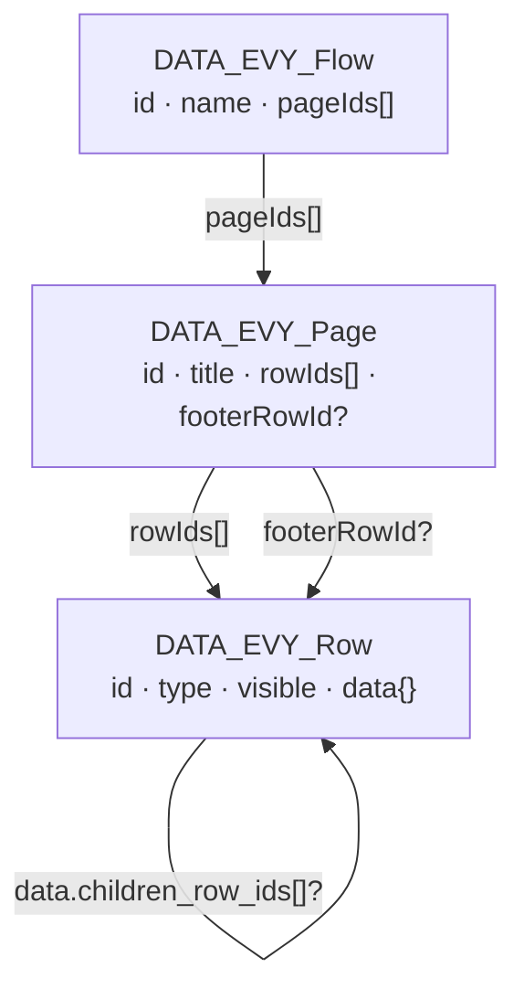
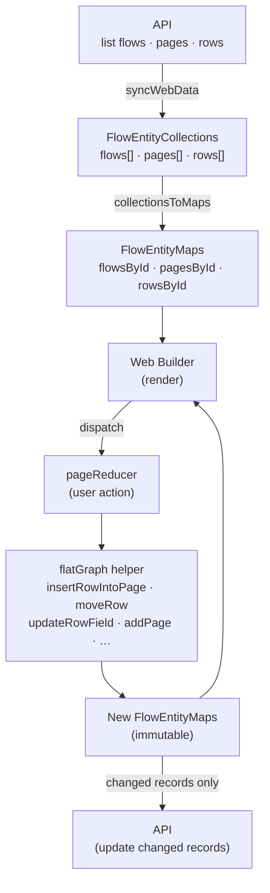
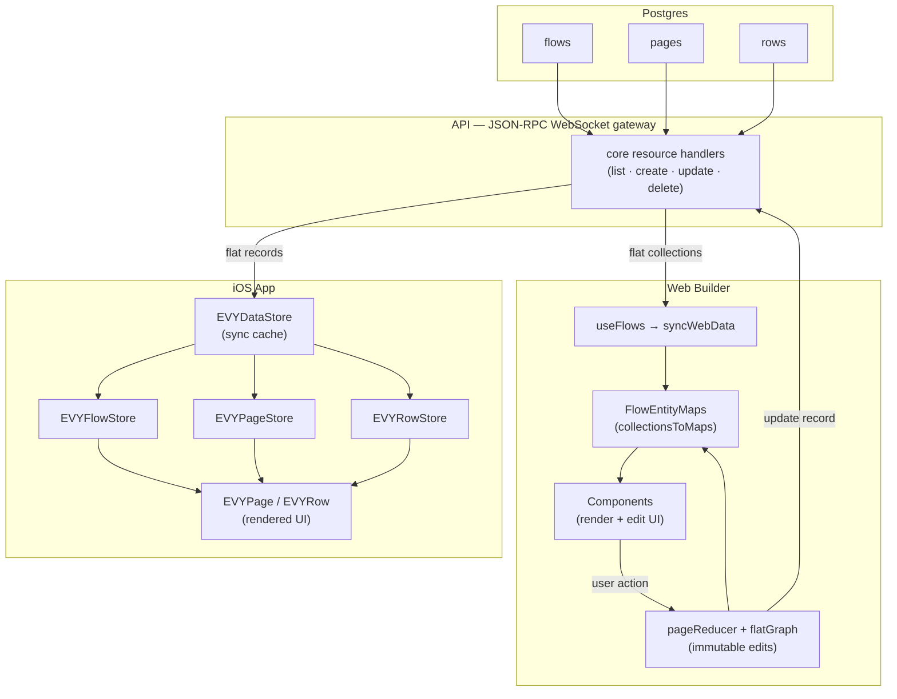

# Server-driven UI

All UI in EVY is server-driven. On the API service we store SDUI as flat `flows`, `pages`, and `rows` resources for all services and UX. Clients assemble those persisted records into the nested `UI_Flow` shape below when rendering, and decompose nested edits back into flat records when saving.

All attributes in SDUI are strings, and most are required.

Row types are defined as standard JSON Schema files in `types/schema/sdui/definitions/*.schema.json`. Each row schema combines the common `UI_RowBase` shape from `types/schema/sdui/evy.schema.json` with row-specific properties and a unique `type.const` discriminator:

```json
{
    "$schema": "https://json-schema.org/draft/2020-12/schema",
    "$id": "sdui/definitions/Calendar",
    "title": "Calendar_Row",
    "allOf": [
        { "$ref": "../evy.schema.json#/$defs/UI_RowBase" },
        {
            "type": "object",
            "required": [
                "type",
                "start_time",
                "end_time",
                "timeslot_interval_minutes",
                "label_interval_minutes",
                "header_format",
                "timeslot_format",
                "source",
                "destination"
            ],
            "properties": {
                "type": { "const": "Calendar" },
                "title": { "type": "string" },
                "source": { "type": "string" },
                "destination": { "type": "string" },
                "secondary": { "type": "string" },
                "start_time": { "type": "string" },
                "end_time": { "type": "string" },
                "timeslot_interval_minutes": { "type": "string" },
                "label_interval_minutes": { "type": "string" },
                "header_format": { "type": "string" },
                "timeslot_format": { "type": "string" }
            }
        }
    ],
    "unevaluatedProperties": false
}
```

## Flow

Flows represent a full user journey (eg: creating an item, placing an order, etc). They are needed to correctly submit data from a set of pages with a single end state.

The canonical shape matches `types/schema/sdui/evy.schema.json`:

```
{
    "id": "uuid",
    "name": "string",
    "pages": [PAGE]
}
```

## Page

A page is an single screen in a flow, for example step 1 in a booking flow.

```
{
    "id": "uuid",
    "name": "string",    // Required. Developer-facing page name.
    "title": "string",   // Shown in the navbar
    "rows": [ROW],
    "footer": ROW        // Optional; shown as sticky footer
}
```

## Row

Rows are what are put into pages. They are the building block of the EVY server-driven UI framework

-   All attributes can include:
    -   variables surrounded with curly braces: "Hello {name}, how are you?"
    -   inline icons as [Lucide](https://lucide.dev/icons) names in kebab-case, wrapped in double colons: "EVY ::image-plus:: is the best!"
-   [ x ]
    -   Denotes a type array of x
-   Objects and arrays
    -   When objects or arrays are interpolated (e.g. `{[resource_id].tags}`), the UI runtime resolves the binding to structured data (e.g. a JSON array of tag objects) before rendering—use the schema and client behavior for the exact shape, not a hand-written JSON fragment in the flow string.

```
{
    "id": "uuid",
    "type": "Button" | "Calendar" | "HorizontalContainer" | "Heading" | "Text" | ... ,

    // Required. Developer-facing row name.
    "name": "string",
    // Required. Header of the row; empty string means no header.
    "title": "string",
    // Row-type-specific attributes live at the row root, e.g. label, text, subtitle, placeholder, value, etc.
    "label": "string",
    "text": "string",

    // Structural relationships (persisted as IDs in row data — see data.md):
    // sheet — optional on every row; overlay content presented via {show(rowId)}
    // child — Search only; one result-row template (not a sheet)
    // children — static nested rows on container types
    // segments — TabContainer tab labels, paired with static children entries
    "sheet": ROW,
    "children": [ROW],
    "child": ROW,

    // Binding fields (only on row types that declare them — see table below):
    // source — where the row reads data (display text, options, collections, or location objects)
    // destination — where writes go; may be a builder expression such as "{buildCurrency(item.price)}"
    // secondary — greyed-out secondary data (Calendar only)
    // value — datum display template for option rows, e.g. "{formatCurrency($datum.price)}"
    //
    // Optional initial value for editable rows (Dropdown, Input, TextArea, InlinePicker only).
    // Seeded into the destination draft as soon as the page/row is activated, so untouched
    // defaults are submitted. Existing destination data or an existing draft always wins.
    // initial: "string",

    // Visibility predicate. Use "true" for always shown, or a condition expression to render only when it evaluates to true.
    "visible": "string",

    // Actions are required on every row (default {}). Each trigger holds an ordered list of UI_RowAction.
    "actions": {
        "tap": [{
            "condition": "{length(title) > 0}",
            "false": { "fn": "highlight_required", "field": "title" },
            "true": { "fn": "create", "service": "[service_id]",
                      "resource": "[resource_id]", "mode": "submit" }
        }]
    }
}
```

#### Row relationships

Every row may declare an optional nested `sheet` row. At runtime, `{show(rowId)}` presents that stored row (or any other row ID loaded in the client) in a sheet overlay. The sheet root row's `title` is the sheet header and is live-interpolated when it contains expressions; put confirmation headings on the sheet root, not on nested rows inside it.

`Search` is the only row type that may declare `child`. That `child` is a **result template**: the iOS app renders one instantiated copy per search result. It is not opened with `show`. A Search row may own both `child` and `sheet` independently.

`VerticalContainer`, `HorizontalContainer`, and `TabContainer` support static `children` (and `TabContainer` uses `segments` paired with those children). Dynamic `source` + per-item `child` templates are not supported; collection-driven layouts must use static structure or row types that bind their own `source`.

**Web builder:** Secondary builder pages edit a row's optional `sheet` only. For Search, the configured `child` template renders **once** inline directly under the search input as a layout sample—it is not a live search and does not mirror API results. When you add or edit a Show action, the row argument defaults to the currently configured row's `sheet` row ID when one exists; you can pick any row from any loaded flow/page instead. Show requires an explicit row ID—there is no zero-argument `{show()}`.

#### Row binding fields

`source`, `destination`, `secondary`, and datum display `value` are row-type-specific — do not add them to rows that do not declare them in the schema.

| Row type | `source` | `destination` | `secondary` | `value` | Notes |
| --- | --- | --- | --- | --- | --- |
| `Input`, `TextArea` | yes | yes | no | no | Display reads `source`; writes pass raw text to `destination`. Optional `initial` seeds literal text into the draft on activation. For `Input` and `TextArea`, `actions.submit` (when present) runs after the user commits a value (return key or blur), after the destination write. Optional `actions.tap` runs on an actual row tap via the generic whole-row tap path (the embedded text field consumes taps on the field to begin editing). |
| `Dropdown`, `InlinePicker` | yes | yes | no | yes | `source` = options; `value` = `$datum` display template; selection writes raw datum to `destination`. Optional `initial` seeds the default selection — a single option identifier for `Dropdown`, and a one-element identifier array for `InlinePicker`. |
| `Search` | yes | yes | no | no | `destination` stores the selected raw datum (builder-aware), stripping external `id` and merging over any existing draft so omitted keys (e.g. instructions) are preserved. Optional `child` is the search **result template** only (not a sheet). Optional `sheet` uses the universal overlay relationship. On result select, iOS also runs `actions.tap` with `$datum` set to the selected result (after the destination write). |
| `Calendar` | yes | yes | yes | no | `source` = main timeslots to display (same binding as `destination`); `destination` = edited selection; `secondary` = greyed background slots. |
| `TimeslotPicker` | yes | yes | no | no | Single selected timeslot string in `destination`. Optional `sheet` for confirmation overlays via `{show(sheetRowId)}`. |
| `SelectPhoto` | yes | yes | no | no | `source` = shown images; `destination` = written image IDs. |
| `TextSelect` | yes | yes | no | no | `source` = current selected state; `destination` = write target. |
| `PhotoGallery`, `Map`, `VerticalContainer`, `HorizontalContainer`, `TabContainer`, `InputList` | yes | no | no | no | Read-only or collection `source`. Containers render static `children` only (`TabContainer`: `segments` paired with `children`). Optional `sheet` on any row type. |
| `Button`, `Text`, `TextAction`, `Heading` | no | no | no | no | `Button` accepts optional `style` `"primary"` (default) or `"danger"` (red on iOS). Any row type may attach optional `sheet`; `TextAction` commonly pairs with `{show(sheetRowId)}`. |

Formatted vs raw: the runtime resolves `source` for display (including `{formatCurrency(...)}` expressions) and exposes raw values for writes. `destination` may use builder functions such as `{buildCurrency(item.price)}` — writes pass raw user/selection data into the builder.

### Initial values

`Dropdown`, `Input`, `TextArea`, and `InlinePicker` accept an optional `initial` string. When the row becomes part of the active page, its `initial` value is written to the destination draft immediately, so that:

- the default is visible before the user edits the row;
- submitting without editing still includes the default.

Value meaning per control:

- `Input` and `TextArea` — literal text.
- `Dropdown` — the selected option identifier, matching what single-selection controls already write.
- `InlinePicker` — one selected option identifier, stored as a one-element identifier array (matching the control's existing destination shape). An absent or empty `initial` keeps the existing empty-array bootstrap.

Precedence: concrete destination data > an existing draft (including a prior user edit) > `initial` > the row type's existing empty bootstrap value. Reappearing or re-rendering a row never restores `initial` over a user change.

Builder destinations (e.g. `{buildCurrency(item.price)}`) transform an `initial` value in the same way as an explicit user edit, so the seeded draft has the same structured shape.

### Actions

Each row has an `actions` attribute: an object keyed by **trigger** name. Each trigger maps to an ordered list of `UI_RowAction` objects (condition / `true` / `false` branches). Supported triggers in this release are `tap`, `delete`, `tap-row`, `tap-column`, `swipe-left`, and `submit`; each row type declares which triggers it supports and whether a trigger is **required** (flow validation requires at least one action on that trigger) or **optional** (may be omitted or empty). The `submit` trigger runs when a row's typed value is committed (return key or blur, after the destination write). It is available on `Input` and `TextArea` only.

```jsonc
"actions": {
  "tap": [{ "condition": "", "false": "", "true": { "fn": "close" } }],
  "submit": [{ "condition": "", "false": "", "true": { "fn": "close" } }],
  "delete": [{ "condition": "", "false": "", "true": { "fn": "delete_photo" } }],
  "tap-row": [{ "condition": "", "false": "", "true": { "fn": "select", "value": "$datum" } }],
  "tap-column": [{ "condition": "", "false": "", "true": { "fn": "select", "value": "$datum" } }],
  "swipe-left": [{ "condition": "", "false": "", "true": { "fn": "show", "rowId": "sheetId" } }]
}
```

An empty object `{}` is the canonical “no actions” state (do not use `{"tap": []}`). The iOS client treats a missing trigger key the same as an empty list.

The **shape** of `actions` is validated by the API on every `create`/`update` of a row: only the six trigger names are accepted, each must map to a list, and each entry must have exactly `condition`, `true`, and `false`. A malformed shape is rejected at write time with the offending path (e.g. `/data/actions/tap/0`) rather than being stored and then silently dropped when a client fails to decode the row. Note this validates structure only — the *contents* of the branch strings are still unchecked at the API.

#### Trigger matrix

| Row type | `tap` | `submit` | `delete` | `tap-row` | `tap-column` | `swipe-left` |
| --- | --- | --- | --- | --- | --- | --- |
| Button | **required** | — | — | — | — | — |
| Calendar | **required** | — | — | **required** | **required** | — |
| Dropdown | **required** | — | — | — | — | — |
| InlinePicker | **required** | — | — | — | — | — |
| InputList | **required** | — | — | — | — | — |
| PhotoGallery | **required** | — | — | — | — | — |
| SelectPhoto | **required** | — | **required** | — | — | — |
| TextAction | **required** | — | — | — | — | — |
| TextExpand | **required** | — | — | — | — | — |
| TextSelect | **required** | — | — | — | — | — |
| TimeslotPicker | **required** | — | — | — | — | — |
| Heading | optional | — | — | — | — | optional |
| HorizontalContainer | optional | — | — | — | — | — |
| Input | optional | optional | — | — | — | optional |
| ListItem | optional | — | — | — | — | optional |
| Map | optional | — | — | — | — | — |
| Search | optional | — | — | — | — | — |
| TabContainer | optional | — | — | — | — | — |
| Text | optional | — | — | — | — | optional |
| TextArea | optional | optional | — | — | — | — |
| VerticalContainer | optional | — | — | — | — | — |

Required triggers are enforced in `validateUiFlow` (fixtures, seed, tests). The web builder shows a required badge and warning when a required trigger has no actions but still allows saving.

All action functions dispatch through a single client-side action channel; navigation (`navigate`, `close`) and non-navigation effects (`create`, `highlight_required`, `select`, `select_photo`, `delete_photo`, `expand_photo`, `expand_text`) are handled by the same runner. **Which list runs** depends on the trigger: row tap gestures and control-specific taps use `actions.tap`; value commit on `Input` and `TextArea` uses `actions.submit`; the `SelectPhoto` remove control uses `actions.delete`; Calendar day headers use `actions.tap-column` and time-axis labels use `actions.tap-row`; swipe-to-reveal on Heading/Input/ListItem/Text uses `actions.swipe-left`.

For row types that handle their own interactive elements (`SelectPhoto`, `TextExpand`, `TextSelect`, `PhotoGallery`, `TabContainer`, `TimeslotPicker`, `Calendar`, `InlinePicker`, `Search`), behaviour on **tap** comes only from `actions.tap`. An empty `tap` list means those taps do nothing. `Input` and `TextArea` use the generic whole-row tap path for `actions.tap` (the embedded text field still consumes taps on the field to begin editing). Calendar axis headings similarly run only `actions.tap-row` / `actions.tap-column`; empty axis triggers mean those headings do nothing.

#### Swipe (`swipe-left`)

On iOS, Heading, Input, ListItem, and Text rows with a non-empty `swipe-left` action list become swipeable (Mail-style trailing reveal). Dragging left reveals a single accent-colored button; releasing past the reveal threshold snaps open, and a fuller swipe executes immediately. Tapping the revealed button runs `actions.swipe-left` with datum `nil` and closes the row. Only one row stays open at a time; tapping open content closes without firing `tap`. Empty or absent `swipe-left` means no swipe affordance.

Optional **`swipeLabel`** (Heading, Input, ListItem, Text only) sets the revealed button content as EVY text (icons like `::check::`, interpolations, etc.). When omitted or blank, iOS shows a white ellipsis icon and uses the accessibility label “Swipe left”.

For destructive or important `create`/`update` actions, attach a `sheet` row to the triggering row and call `{show(sheetRowId)}` with that sheet row's ID (often the nested `sheet.id`). Put confirmation copy on the sheet root's `title` and message rows inside the sheet, then run the actual `create`/`update` followed by `{close()}` from a confirm button in the sheet.

Inside a sheet overlay, `{close()}` dismisses the sheet instead of popping navigation.

#### Sequencing

A row's action list for a given trigger runs **in order**. For each entry: if its `condition` is empty or evaluates true, the `true` branch runs and the runner moves on to the next entry; if the condition evaluates false, the `false` branch runs and the array stops (no later entries execute). If a branch's function throws (e.g. malformed arguments), the error is surfaced and the array also stops — later entries do not run. A condition that **cannot be evaluated** (malformed expression) is likewise an error, not a false result: the error is surfaced and the array stops without running either branch. This is what makes multi-step sequences like "create, then close" or "select timeslot, then show confirmation sheet" expressible as separate action entries. When a sheet interpolates the new selection (e.g. `Request {formatDatetime(selected_pickup_timeslot, "HH:mm")}`), put `{select($datum)}` **before** `{show(...)}`.

#### Conditions

- Empty `condition` — treated as always true (the `true` branch is taken unless you rely on client-specific rules).
- A malformed condition is an **error**, not `false` — it surfaces to the user and stops the action array. A condition whose data paths simply do not resolve is not malformed; it evaluates false as usual.
- Operators: `==`, `!=`, `>`, `<`, `>=`, `<=`
- AND: join comparisons with `&&` inside the braces:
	`{length(title) > 0 && price.value >= 1}`
- OR: join comparisons with `||` inside the braces:
	`{count(pickup_selection) > 0 || count(delivery_selection) > 0 || count(shipping_destination_areas) > 0}`
- Grouping: use parentheses to control precedence:
	`{(length(title) > 0 && price.value >= 1) || override == true}`
- Boolean literals `true` and `false` are valid as standalone conditions or operands.
- Condition helpers (used like functions in the expression):
	- `count(var)` — number of elements in a list/array, e.g. `{count(photo_ids) > 0}`
	- `length(var)` — number of characters in a string, e.g. `{length(title) > 0}`
	- `earliestDatetime(var)` — chronologically earliest ISO datetime string in an array, e.g. `{selected_pickup_timeslot != earliestDatetime(item.pickup_selection)}`

#### Branches (`true` / `false`)

Each branch is either the empty string, meaning "do nothing", or a **structured action invocation**: an object naming the function and its arguments.

```jsonc
"true": { "fn": "close" }
"true": { "fn": "show", "rowId": "b8c7d6e5-…" }
"true": { "fn": "create", "service": "…", "resource": "items", "mode": "submit" }
"true": { "fn": "update", "service": "…", "resource": "items",
          "mode": "store", "filter": { "id": "item.id" },
          "changes": { "status": "accepted" } }
```

The shape of every invocation is defined in [`types/schema/sdui/action.schema.json`](../../types/schema/sdui/action.schema.json) and enforced by the API on write, so a malformed action is rejected at the source rather than failing silently when tapped.

Legacy `{functionName(arg1, arg2)}` **strings are no longer accepted** — the API rejects them and clients cannot execute them. `scripts/migrate-actions-to-ast.ts` converts stored rows in environments that still hold them; it is a one-off and should be deleted once every environment reports zero conversions.

Value expressions inside `data`, `filter`, `changes` and `query` remain strings and resolve exactly as before (data path, `$datum`, quoted literal, bare word), because whether a bare word is a path or a literal depends on the data present when the action runs.

Supported invocations. The `fn` value selects the shape; every field below is required unless marked optional.

| `fn` | Fields | Meaning |
| --- | --- | --- |
| `close` | — | Close the current UI. Inside a sheet overlay, dismisses the sheet only. |
| `select_photo` | — | Ask the triggering `SelectPhoto` row to present the photo picker. |
| `delete_photo` | — | Remove the photo tile that was tapped. |
| `expand_photo` | — | Present the current `PhotoGallery` photo full screen. |
| `show` | `rowId` | Present that row in a sheet overlay. The target may be on any synced page. |
| `expand_text` | `rowId` | Expand the `TextExpand` row with that id, wherever it is on screen. |
| `highlight_required` | `field` | Mark a field as required / show validation. |
| `select` | `value` | Ask the triggering row to select `value`, usually `$datum`. |
| `navigate` | `flowId`, `pageId`, `query` (optional) | Go to a page within a flow. `query` is a map of value expressions. |
| `create` | `service`, `resource`, `mode`, plus mode fields | `mode: "submit"` merges the flow's create drafts; `mode: "inline"` takes `data`; `mode: "fromPath"` takes `dataPath`. Both non-submit modes accept an optional `idDestination`. Never changes routes — follow with `close` to dismiss. |
| `update` | `service`, `resource`, `mode`, `filter`, `changes` \| `changesPath` | `mode: "store"` requires a non-empty `filter` and updates matching records; `mode: "draft"` takes no filter and writes into the active create draft. Changes are either a map or a whole-object path, never both. |

The older per-function notes below describe the same behaviour in the previous call syntax:

| Function | Meaning |
| -------- | ------- |
| `close()` | Close current UI, e.g. `{close()}`. Inside a sheet overlay, dismisses the sheet only. |
| `create(service_id, resource_id, submit \| data, id_destination?)` | Create a domain entity. **Never changes routes** — with `submit` as the third argument, merges the active flow's create drafts into the created entity and cleans them up (two-argument create is invalid). With a plain-text data object `{key: value, …}`, resolves its data-path or `$datum` values, preserves unresolved bare words as literals (bare `true`/`false` resolve as booleans, bare `null` resolves as JSON null, quoted `"…"` values stay literal strings, and `{…}` values resolve as nested objects), and creates that one entity immediately. Alternatively, pass a **data path** (bare identifier, e.g. `pickup_address`) as the third argument to send the whole resolved object from drafts or synced data. Optional fourth argument writes the generated uuid to a draft-aware destination path (e.g. `{pickup_address.id}`) — use this in **create flows** where the target record does not exist yet. When the target record already exists, link it with a follow-up store-mode `update` action instead of writing onto the live record path. Either way, a flow that should close after submitting must do so explicitly with a following `{close()}` action. |
| `update(service_id, resource_id, filter, changes, draft?)` | Update matching domain entities immediately (store mode, default), or write into the active create draft (`draft` fifth argument with filter `{}`). Resolves filter and changes like inline `create` data (including boolean, `null`, quoted-string, and nested-object literals), or pass a **data path** as `changes` to merge a whole draft object (the client strips any `id` key from path-resolved changes before merging). Change keys may use dotted paths (e.g. `transfer_options.pickup.address_id`) to patch nested fields without clobbering siblings. A filter value of `null` matches records where the property is absent or JSON `null`. Locally finds rows where every filter property matches, merges changes, refreshes matching cache-scope entities, then syncs each match to the server with an `update` RPC. Store mode requires a non-empty filter; `changes` is required as either a non-empty `{…}` object or a data path. A store-mode update matching nothing is a no-op. |
| `navigate(flowId, pageId, queryParams?)` | Go to a page within a flow, e.g. `{navigate(flowId, pageId)}`. Pass query params as the optional third argument using a plain-text query object, e.g. `{navigate(flowId, pageId, {id: $datum.id})}`. |
| `show(rowId)` | Present the row with ID `rowId` in a sheet overlay, e.g. `{show(b8c7d6e5-f4a3-4b2c-9d1e-0f8a7b6c5d4e)}`. Requires exactly one non-empty row ID. The target may belong to any page in the synced flow data, not only the action row's nested `sheet`. If the ID is missing from the client row store, the action fails and later actions in the same array do not run. The presented row's `title` is the sheet header (live-interpolated when it contains expressions). |
| `highlight_required(field)` | Mark a field as required / show validation, e.g. `{highlight_required(title)}` |
| `select(value)` | Ask the triggering row to select `value`. The row defines semantics (toggle bool, toggle array membership, write a scalar, switch segment, or batch-toggle). Usually `{select($datum)}` where `$datum` is the tapped unit (timeslot ISO string, array of ISO strings for a Calendar axis tap, option object, segment index, etc.). Rows without a select handler treat this as an error. |
| `select_photo()` | Ask the triggering `SelectPhoto` row to present the photo picker. |
| `delete_photo()` | Ask the triggering `SelectPhoto` row to remove the photo tile that was tapped (same effect as the built-in delete control when using the default action). |
| `expand_photo()` | Ask the triggering `PhotoGallery` row to present the current photo full screen. |
| `expand_text(rowId)` | Expand the `TextExpand` row with ID `rowId` (cross-row, like `show`). Requires exactly one non-empty row ID. |

Note that the web builder does not execute actions; it only stores these strings and displays mocks.

#### Examples (from `scripts/fixtures/services/service_sdui.json`)

Validate several fields with empty `true` steps, then navigate:

```json
{
	"condition": "{length(title) > 0}",
	"false": { "fn": "highlight_required", "field": "title" },
	"true": ""
}
```

Final “Next” after validations:

```json
{
	"condition": "",
	"false": "",
	"true": { "fn": "navigate", "flowId": "[flow_id]", "pageId": "[page_id]" }
}
```

Navigate with query params (selects an entity from synced data):

```json
{
	"condition": "",
	"false": "",
	"true": { "fn": "navigate", "flowId": "[flow_id]", "pageId": "[page_id]",
	          "query": { "id": "$datum.id" } }
}
```

OR condition with navigate on success:

```json
{
	"condition": "{count(pickup_selection) > 0 || count(delivery_selection) > 0 || count(shipping_destination_areas) > 0}",
	"false": { "fn": "highlight_required", "field": "pickup_selection" },
	"true": { "fn": "navigate", "flowId": "[flow_id]", "pageId": "[another_page_id]" }
}
```

Submit:

```json
[
	{
		"condition": "",
		"false": "",
		"true": { "fn": "create", "service": "[service_id]",
		          "resource": "[resource_id]", "mode": "submit" }
	},
	{
		"condition": "",
		"false": "",
		"true": { "fn": "close" }
	}
]
```

Open a confirmation sheet after selecting a timeslot (`select` must run first so sheet title interpolations see the new value):

```json
{
	"id": "timeslot-picker-row-id",
	"type": "TimeslotPicker",
	"actions": {
		"tap": [
			{
				"condition": "",
				"false": "",
				"true": { "fn": "select", "value": "$datum" }
			},
			{
				"condition": "",
				"false": "",
				"true": { "fn": "show", "rowId": "b8c7d6e5-f4a3-4b2c-9d1e-0f8a7b6c5d4e" }
			}
		]
	},
	"sheet": {
		"id": "b8c7d6e5-f4a3-4b2c-9d1e-0f8a7b6c5d4e",
		"type": "VerticalContainer",
		"title": "Confirmation",
		"children": []
	}
}
```

Search result template (`child` only on Search; separate from `sheet`).

### Address save pattern (create and edit flows)

Use the same two-action `tap` array on the pickup Search row for create and edit flows, but the **link** step differs by flow type.

1. **Create or update the address** — if `address_id` is empty, `{create(core, addresses, pickup_address, {pickup_address.id})}` persists the address and writes the generated id to the page-local `pickup_address` buffer; otherwise `{update(core, addresses, {id: item.transfer_options.pickup.address_id}, pickup_address)}` updates the existing row.
2. **Link the item** — on **edit** flows where the item row already exists: `{update(marketplace, items, {id: item.id}, {transfer_options.pickup.address_id: pickup_address.id})}` matches the row and syncs immediately. On **create** flows: `{update(marketplace, items, {}, {transfer_options.pickup.address_id: pickup_address.id}, draft)}` writes into the create draft (picked up by submit `create`). A page shared across both flow types needs condition-branched actions (store vs draft link) because one action string no longer serves both.

When an address already exists, the first action's `false` branch runs and **stops the action array** (runner semantics), so the link step does not run again on re-pick.

```json
{
	"id": "search-row-id",
	"type": "Search",
	"source": "{$api:place_search}",
	"destination": "{pickup_address}",
	"actions": {
		"tap": [
			{
				"condition": "{length(item.transfer_options.pickup.address_id) == 0}",
				"true": { "fn": "create", "service": "core", "resource": "addresses",
				          "mode": "fromPath", "dataPath": "pickup_address",
				          "idDestination": "{pickup_address.id}" },
				"false": { "fn": "update", "service": "core", "resource": "addresses",
				           "mode": "store",
				           "filter": { "id": "item.transfer_options.pickup.address_id" },
				           "changesPath": "pickup_address" }
			},
			{
				"condition": "",
				"true": { "fn": "update", "service": "marketplace", "resource": "items",
				          "mode": "draft",
				          "changes": { "transfer_options.pickup.address_id": "pickup_address.id" } },
				"false": ""
			}
		]
	},
	"child": {
		"id": "387ebe5b-b5b5-4be9-b5db-918bb9db706f",
		"type": "Text",
		"title": "{$datum.unit} {$datum.street}",
		"subtitle": "{$datum.postcode} {$datum.city}, {$datum.state}"
	}
}
```

---

## Architecture: flat storage model

Flows, pages, and rows are stored as three independent database tables and transferred as flat record collections. Neither the API nor the transport layer embeds nested objects — clients assemble the tree in memory.

### Entity relationships

Each entity references others by ID only. Rows can nest arbitrarily deep via two optional link fields stored inside `data`:



### flatGraph — web builder mutation helpers

`flatGraph.ts` exposes a set of pure, immutable helpers that take a `FlowEntityMaps` snapshot (three ID-keyed lookup maps) and return a new snapshot. No entity is ever mutated in place. The web builder's `pageReducer` dispatches every user action through one of these helpers, then syncs only the changed records back to the API.



---

## iOS and Web: SDUI data flow

Both clients connect to the same JSON-RPC WebSocket gateway. The API returns flows, pages, and rows as independent flat collections. Each client builds its own in-memory representation:

- **Web builder** converts records to ID-keyed maps and uses `flatGraph.ts` for all edits. Changes are written back to the API as individual record updates.
- **iOS app** stores records in `EVYDataStore` and resolves them on demand through typed store accessors (`EVYFlowStore`, `EVYPageStore`, `EVYRowStore`). Rows follow `sheet_row_id`, Search-only `child_row_id`, and container `children_row_ids` links at render time; `{show(rowId)}` resolves targets through `EVYRowStore` across pages.


