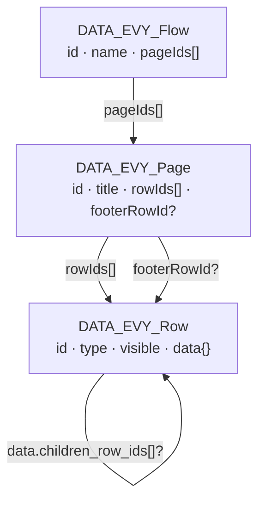
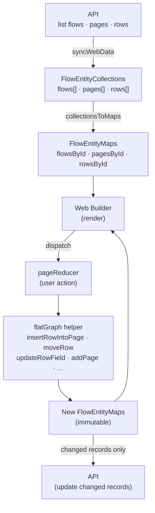
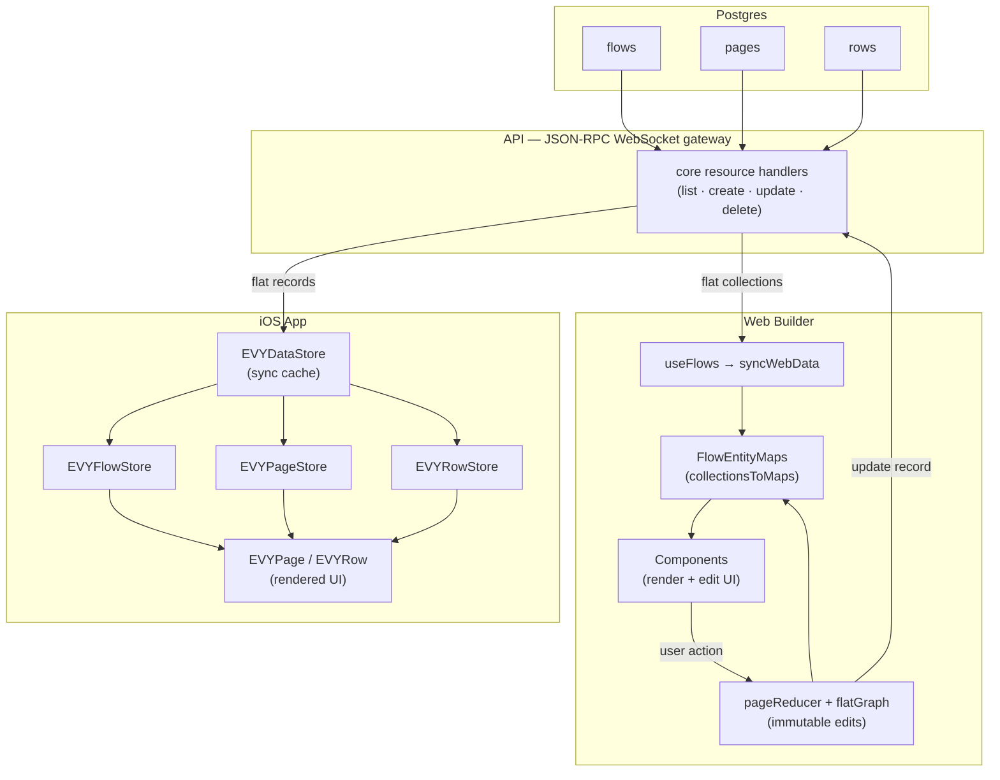

# Server-driven UI

All UI in EVY is server-driven. On the API service we store SDUI as flat `flows`, `pages`, and `rows` resources for all services and UX. Clients assemble those persisted records into the nested `UI_Flow` shape below when rendering, and decompose nested edits back into flat records when saving.

All attributes in SDUI are strings, and most are required.

Row types are defined as standard JSON Schema files in `types/schema/sdui/definitions/*.schema.json`. Each row schema combines the common `UI_RowBase` shape from `types/schema/sdui/evy.schema.json` with row-specific properties and a unique `type.const` discriminator:

```json
{
    "$schema": "https://json-schema.org/draft/2020-12/schema",
    "$id": "sdui/definitions/Calendar",
    "title": "Calendar_Row",
    "allOf": [
        { "$ref": "../evy.schema.json#/$defs/UI_RowBase" },
        {
            "type": "object",
            "required": [
                "type",
                "start_time",
                "end_time",
                "timeslot_interval_minutes",
                "label_interval_minutes",
                "header_format",
                "timeslot_format",
                "source",
                "destination"
            ],
            "properties": {
                "type": { "const": "Calendar" },
                "title": { "type": "string" },
                "source": { "type": "string" },
                "destination": { "type": "string" },
                "secondary": { "type": "string" },
                "start_time": { "type": "string" },
                "end_time": { "type": "string" },
                "timeslot_interval_minutes": { "type": "string" },
                "label_interval_minutes": { "type": "string" },
                "header_format": { "type": "string" },
                "timeslot_format": { "type": "string" }
            }
        }
    ],
    "unevaluatedProperties": false
}
```

## Flow

Flows represent a full user journey (eg: creating an item, placing an order, etc). They are needed to correctly submit data from a set of pages with a single end state.

The canonical shape matches `types/schema/sdui/evy.schema.json`:

```
{
    "id": "uuid",
    "name": "string",
    "pages": [PAGE]
}
```

## Page

A page is an single screen in a flow, for example step 1 in a booking flow.

```
{
    "id": "uuid",
    "name": "string",    // Required. Developer-facing page name.
    "title": "string",   // Shown in the navbar
    "rows": [ROW],
    "footer": ROW        // Optional; shown as sticky footer
}
```

## Row

Rows are what are put into pages. They are the building block of the EVY server-driven UI framework

-   All attributes can include:
    -   variables surrounded with curly braces: "Hello {name}, how are you?"
    -   inline icons as [Lucide](https://lucide.dev/icons) names in kebab-case, wrapped in double colons: "EVY ::image-plus:: is the best!"
-   [ x ]
    -   Denotes a type array of x
-   Objects and arrays
    -   When objects or arrays are interpolated (e.g. `{[resource_id].tags}`), the UI runtime resolves the binding to structured data (e.g. a JSON array of tag objects) before rendering—use the schema and client behavior for the exact shape, not a hand-written JSON fragment in the flow string.

```
{
    "id": "uuid",
    "type": "Button" | "Calendar" | "HorizontalContainer" | "Heading" | "Text" | ... ,

    // Required. Developer-facing row name.
    "name": "string",
    // Required. Header of the row; empty string means no header.
    "title": "string",
    // Row-type-specific attributes live at the row root, e.g. label, text, subtitle, placeholder, value, etc.
    "label": "string",
    "text": "string",
    // Layout: "children" (array of rows), "child" (single row), "segments" (array of strings).
    // Optional array of children rows to display
    "children": [ROW],
    // Optional single child row to display
    "child": ROW,

    // Binding fields (only on row types that declare them — see table below):
    // source — where the row reads data (display text, options, collections, or location objects)
    // destination — where writes go; may be a builder expression such as "{buildCurrency(item.price)}"
    // secondary — greyed-out secondary data (Calendar only)
    // value — datum display template for option rows, e.g. "{formatCurrency($datum.price)}"
    //
    // Optional initial value for editable rows (Dropdown, Input, TextArea, InlinePicker only).
    // Seeded into the destination draft as soon as the page/row is activated, so untouched
    // defaults are submitted. Existing destination data or an existing draft always wins.
    // initial: "string",

    // Visibility predicate. Use "true" for always shown, or a condition expression to render only when it evaluates to true.
    "visible": "string",

    // Actions are required on every row and default to an empty array
    "actions": [{
        "condition": "{length(title) > 0}",
        "false": "{highlight_required(title)}",
        "true": "{create([service_id],[resource_id])}"
    }]
}
```

#### Row binding fields

`source`, `destination`, `secondary`, and datum display `value` are row-type-specific — do not add them to rows that do not declare them in the schema.

| Row type | `source` | `destination` | `secondary` | `value` | Notes |
| --- | --- | --- | --- | --- | --- |
| `Input`, `TextArea` | yes | yes | no | no | Display reads `source`; writes pass raw text to `destination`. Optional `initial` seeds literal text into the draft on activation. |
| `Dropdown`, `InlinePicker` | yes | yes | no | yes | `source` = options; `value` = `$datum` display template; selection writes raw datum to `destination`. Optional `initial` seeds the default selection — a single option identifier for `Dropdown`, and a one-element identifier array for `InlinePicker`. |
| `Search` | yes | yes | no | no | `destination` stores the selected raw datum (builder-aware). |
| `Calendar` | yes | yes | yes | no | `source` = main timeslots to display (same binding as `destination`); `destination` = edited selection; `secondary` = greyed background slots. |
| `TimeslotPicker` | yes | yes | no | no | Single selected timeslot string in `destination`. Optional `child` row is shown in a sheet when `{show()}` runs. |
| `SelectPhoto` | yes | yes | no | no | `source` = shown images; `destination` = written image IDs. |
| `TextSelect` | yes | yes | no | no | `source` = current selected state; `destination` = write target. |
| `PhotoGallery`, `Map`, `VerticalContainer`, `HorizontalContainer`, `TabContainer`, `InputList` | yes | no | no | no | Read-only or collection source. `VerticalContainer`, `HorizontalContainer`, and `TabContainer` may also declare optional `child` (template row) and `source` (collection binding): the runtime renders one instantiated `child` per resolved item **before** static `children`. For `TabContainer`, dynamic tab labels use each instance's interpolated `title`, or `Item N` when empty; static `segments`/`children` pairs follow. |
| `Button`, `Text`, `TextAction`, `Heading` | no | no | no | no | `Button` accepts an optional `style` of `"primary"` (default) or `"danger"` (red background on iOS) and an optional `child` row shown in a sheet when `{show()}` runs. |

Formatted vs raw: the runtime resolves `source` for display (including `{formatCurrency(...)}` expressions) and exposes raw values for writes. `destination` may use builder functions such as `{buildCurrency(item.price)}` — writes pass raw user/selection data into the builder.

### Initial values

`Dropdown`, `Input`, `TextArea`, and `InlinePicker` accept an optional `initial` string. When the row becomes part of the active page, its `initial` value is written to the destination draft immediately, so that:

- the default is visible before the user edits the row;
- submitting without editing still includes the default.

Value meaning per control:

- `Input` and `TextArea` — literal text.
- `Dropdown` — the selected option identifier, matching what single-selection controls already write.
- `InlinePicker` — one selected option identifier, stored as a one-element identifier array (matching the control's existing destination shape). An absent or empty `initial` keeps the existing empty-array bootstrap.

Precedence: concrete destination data > an existing draft (including a prior user edit) > `initial` > the row type's existing empty bootstrap value. Reappearing or re-rendering a row never restores `initial` over a user change.

Builder destinations (e.g. `{buildCurrency(item.price)}`) transform an `initial` value in the same way as an explicit user edit, so the seeded draft has the same structured shape.

### Actions

Each row has an `actions` attribute which is an array of `UI_RowAction` objects that can trigger various actions if a condition is met or not met. All action functions dispatch through a single client-side action channel; navigation (`navigate`, `close`) and non-navigation effects (`create`, `highlight_required`) are handled by the same runner.

For destructive or important `create`/`update` actions, use a `{show()}` child sheet: put the confirmation copy on the child row's `title` and message rows, then run the actual `create`/`update` followed by `{close()}` from a confirm button inside the sheet.

Inside a sheet opened with `{show()}`, `{close()}` dismisses the sheet instead of popping navigation.

#### Sequencing

A row's `actions` array runs **in order**. For each entry: if its `condition` is empty or evaluates true, the `true` branch runs and the runner moves on to the next entry; if the condition evaluates false, the `false` branch runs and the array stops (no later entries execute). If a branch's function throws (e.g. malformed arguments), the error is surfaced and the array also stops — later entries do not run. This is what makes multi-step sequences like "create, then close" expressible as two separate action entries (see Submit below).

#### Conditions

- Empty `condition` — treated as always true (the `true` branch is taken unless you rely on client-specific rules).
- Operators: `==`, `!=`, `>`, `<`, `>=`, `<=`
- AND: join comparisons with `&&` inside the braces:
	`{length(title) > 0 && price.value >= 1}`
- OR: join comparisons with `||` inside the braces:
	`{count(pickup_selection) > 0 || count(delivery_selection) > 0 || count(shipping_destination_areas) > 0}`
- Grouping: use parentheses to control precedence:
	`{(length(title) > 0 && price.value >= 1) || override == true}`
- Boolean literals `true` and `false` are valid as standalone conditions or operands.
- Condition helpers (used like functions in the expression):
	- `count(var)` — number of elements in a list/array, e.g. `{count(photo_ids) > 0}`
	- `length(var)` — number of characters in a string, e.g. `{length(title) > 0}`
	- `earliestDatetime(var)` — chronologically earliest ISO datetime string in an array, e.g. `{selected_pickup_timeslot != earliestDatetime(item.pickup_selection)}`

#### Branches (`true` / `false`)

Each branch is a string. Empty string means "do nothing" for that branch.

Action branches **must** be wrapped in curly braces to be executed: `{functionName(arg1, arg2, ...)}`. A bare function name without braces (e.g. `close` or `close()`) is treated as inert text and will not trigger any action.

Supported action functions:

| Function | Meaning |
| -------- | ------- |
| `close()` | Close current UI, e.g. `{close()}`. Inside a `{show()}` sheet, dismisses the sheet only. |
| `create(service_id, resource_id, data?)` | Create a domain entity. **Never changes routes** — with a plain-text data object, resolves its data-path or `$datum` values, preserves unresolved bare words as literals (bare `true`/`false` resolve as booleans, bare `null` resolves as JSON null, quoted `"…"` values stay literal strings, and `{…}` values resolve as nested objects), and creates that one entity immediately, e.g. `{create([service_id],[resource_id],{fk: $datum.id, service: "[service_id]", resource: "[items_resource_id]", archivedAt: null, data: {type: pickup, time: selected_pickup_timeslot}})}`. The client stamps `createdAt` on the payload when absent. With no data, it submits the active flow's drafts (merging them into the created entity) and cleans them up — the client decides this by comparing the active draft scope to the target resource. Either way, a flow that should close after submitting must do so explicitly with a following `{close()}` action. For user confirmation, present a `{show()}` child sheet and run `create` from the sheet's confirm button. |
| `update(service_id, resource_id, filter, changes)` | Update matching domain entities immediately. Resolves filter and changes like inline `create` data (including boolean, `null`, quoted-string, and nested-object literals); a filter value of `null` matches records where the property is absent or JSON `null`. Locally finds rows where every filter property matches, merges changes, then syncs each match to the server with an `update` RPC. Filter and changes objects are required and non-empty, e.g. `{update([service_id],[resource_id],{fk: [items_resource].id, archivedAt: null},{archivedAt: now()})}`. For user confirmation, present a `{show()}` child sheet and run `update` from the sheet's confirm button. |
| `navigate(flowId, pageId, queryParams?)` | Go to a page within a flow, e.g. `{navigate(flowId, pageId)}`. Pass query params as the optional third argument using a plain-text query object, e.g. `{navigate(flowId, pageId, {id: $datum.id})}`. |
| `show()` | Present the row's singular `child` in a sheet overlay, e.g. `{show()}`. Requires a `child` row on `TimeslotPicker` or `Button`; no arguments. The child's `title` is shown as the sheet's main header (like a page title) and is live-interpolated when it contains expressions; put sheet headings on the root child row, not nested rows. |
| `highlight_required(field)` | Mark a field as required / show validation, e.g. `{highlight_required(title)}` |

Note that the web builder does not execute actions; it only stores these strings and displays mocks.

#### Examples (from `scripts/fixtures/services/service_sdui.json`)

Validate several fields with empty `true` steps, then navigate:

```json
{
	"condition": "{length(title) > 0}",
	"false": "{highlight_required(title)}",
	"true": ""
}
```

Final “Next” after validations:

```json
{
	"condition": "",
	"false": "",
	"true": "{navigate([flow_id],[page_id])}"
}
```

Navigate with query params (selects an entity from synced data):

```json
{
	"condition": "",
	"false": "",
	"true": "{navigate([flow_id],[page_id],{id: $datum.id})}"
}
```

OR condition with navigate on success:

```json
{
	"condition": "{count(pickup_selection) > 0 || count(delivery_selection) > 0 || count(shipping_destination_areas) > 0}",
	"false": "{highlight_required(pickup_selection)}",
	"true": "{navigate([flow_id],[another_page_id])}"
}
```

Submit:

```json
[
	{
		"condition": "",
		"false": "",
		"true": "{create([service_id],[resource_id])}"
	},
	{
		"condition": "",
		"false": "",
		"true": "{close()}"
	}
]
```

---

## Architecture: flat storage model

Flows, pages, and rows are stored as three independent database tables and transferred as flat record collections. Neither the API nor the transport layer embeds nested objects — clients assemble the tree in memory.

### Entity relationships

Each entity references others by ID only. Rows can nest arbitrarily deep via two optional link fields stored inside `data`:



### flatGraph — web builder mutation helpers

`flatGraph.ts` exposes a set of pure, immutable helpers that take a `FlowEntityMaps` snapshot (three ID-keyed lookup maps) and return a new snapshot. No entity is ever mutated in place. The web builder's `pageReducer` dispatches every user action through one of these helpers, then syncs only the changed records back to the API.



---

## iOS and Web: SDUI data flow

Both clients connect to the same JSON-RPC WebSocket gateway. The API returns flows, pages, and rows as independent flat collections. Each client builds its own in-memory representation:

- **Web builder** converts records to ID-keyed maps and uses `flatGraph.ts` for all edits. Changes are written back to the API as individual record updates.
- **iOS app** stores records in `EVYDataStore` and resolves them on demand through typed store accessors (`EVYFlowStore`, `EVYPageStore`, `EVYRowStore`). Container rows follow `child_row_id` / `children_row_ids` links at render time.


