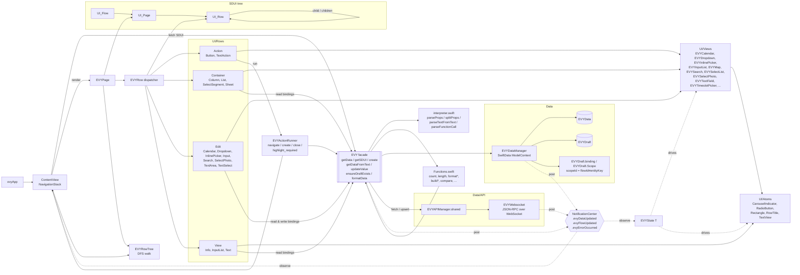

# evy iOS App

iOS consumer app. Minimum iOS version supported: 13.0.

For local and e2e runs, define `API_HOST` in the repository root `.env` file (for example `API_HOST=localhost:8000`).

Shared types: Domain and RPC contracts are defined in the repo root at `types/schema/` (JSON Schema). TypeScript and Swift are generated into `types/generated/`. The iOS app keeps its own Codable models (e.g. `EVYFlow`, `EVYPage`, `EVYRow`, notification structs in `EVYWebsocket`) in sync with those schemas; when you change a schema, update the corresponding Swift types and run `bun run types:generate` from the repo root so api/web stay in sync.

### Architecture

