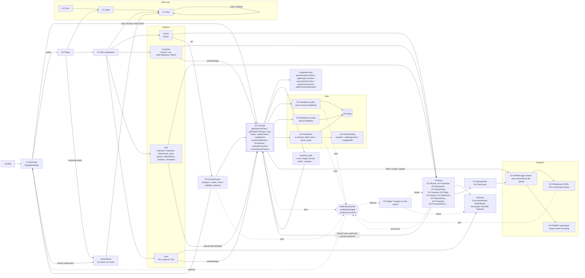

# evy iOS App

The EVY app! Open Xcode, hit run, and Bob's your uncle.

### Architecture

```mermaid
flowchart LR
    App[evyApp]
    Content[ContentView<br/>NavigationStack]
    App --> Content

    subgraph sdui [SDUI tree]
        Flow[UI_Flow]
        Page[UI_Page]
        Row[UI_Row]
        Flow --> Page --> Row
        Row -->|child / children| Row
    end

    Content -->|sync services / fetch SDUI| EVY
    Content -->|render| EVYPage
    EVYPage --> Page
    EVYPage --> EVYRow[EVYRow dispatcher]
    EVYRow --> Row

    subgraph rows [UI/Rows]
        Action[Action<br/>Button]
        Container[Container<br/>Column, List, SelectSegment, Sheet]
        Edit[Edit<br/>Calendar, Dropdown, InlinePicker, Input,<br/>Search, SelectPhoto, TextArea, TextSelect]
        ViewRows[View<br/>Info, InputList, Text]
    end
    EVYRow --> Action
    EVYRow --> Container
    EVYRow --> Edit
    EVYRow --> ViewRows

    Views[UI/Views<br/>EVYButton, EVYCalendar, EVYDropdown, EVYInlinePicker,<br/>EVYInputList, EVYMap, EVYSearch, EVYSelectList,<br/>EVYSelectPhoto, EVYTextField, EVYTimeslotPicker, ...]
    Atoms[UI/Atoms<br/>CarouselIndicator, RadioButton,<br/>Rectangle, RowTitle, TextView]
    Action --> Views
    Edit --> Views
    Container --> Views
    ViewRows --> Atoms
    Views --> Atoms

    EVY[[EVY facade<br/>getDataFromText / getDataFromProps / sync<br/>create / updateValue / updateData<br/>ensureDraftExists / formatData / evaluateFromText<br/>resolveQueryParams]]
    Action -->|run| Runner[EVYActionRunner<br/>navigate / create / close /<br/>highlight_required]
    Runner --> Content
    Runner --> EVY

    Edit -->|read & write bindings| EVY
    ViewRows -->|read bindings| EVY
    Container -->|read bindings| EVY

    Interpreter[interpreter.swift<br/>parsePropsFromText / splitPropsFromText /<br/>parseTextFromText / parseFunctionCall /<br/>splitFunctionArguments]
    Functions[functions.swift<br/>count, length, format*,<br/>build*, compare, ...]
    EVY --> Interpreter
    EVY --> Functions
    Functions --> EVY

    RowVisitor[forEachRow<br />recursive row visitor]
    Content -->|extract create keys| RowVisitor
    EVYPage -->|bootstrap drafts| RowVisitor
    RowVisitor --> Row

    subgraph data [Data]
        PublicStore[EVYDataStore public<br />server-synced SwiftData]
        PrivateStore[EVYDataStore private<br />$local SwiftData]
        DraftStore[EVYDraftStore<br />in-memory draft cache + active scope]
        EntityModel[(EVYData)]
        DraftPath[EVYDraft.Binding<br />scopeId + pathSegments + mergeMode]
        PublicStore --> EntityModel
        PrivateStore --> EntityModel
        DraftStore --> EntityModel
        DraftStore --> DraftPath
    end
    EVY --> PublicStore
    EVY --> PrivateStore
    EVY --> DraftStore

    Views -->|Search rows read local synced resources| EVY

    subgraph api [Data/API]
        APIManager[EVYAPIManager shared auth subscriptions file upload]
        WS[EVYWebsocket JSON-RPC and binary frames]
        FileRPC[EVYFileRPC generated aliases frame encoding]
        APIManager --> WS
        APIManager --> FileRPC
    end
    RemoteFile[EVYRemoteFile EVYFileCache]
    Views --> RemoteFile
    RemoteFile --> APIManager
    EVY -->|fetch / create / update| APIManager

    Notif{{NotificationCenter<br />.evyDataChanged<br />.evyErrorOccurred}}
    PublicStore -. post .-> Notif
    DraftStore -. post .-> Notif
    EVY -. post .-> Notif
    Runner -. post .-> Notif
    WS -. post .-> Notif
    Views -. post errors .-> Notif
    Notif -. observe .-> Content
    Notif -. observe .-> EVYState["EVYState T (single or multi-watch)"]
    EVYState -. drives .-> Views
    EVYState -. drives .-> Atoms
```

### Architectural highlights

**sync**: At startup, the app calls the API and stores each returned resource under a service-qualified key: `<service>:<resource>` (for example, `[evy_core_service_id]:sdui`, `[marketplace_service_id]:[items_resource_id]`, or `[marketplace_service_id]:[conditions_resource_id]`).

**page parameters**: Pages can receive query parameters through navigation actions, think of them like URL query parameters in web. They get resolved against resources already synced by the app, or draft data in progress (eg a booking you are in the process of making).

**file uploads**: send binary frames over the authenticated WebSocket and finalise with a `create` RPC. If finalisation fails, a `cancelUpload` RPC cleans up the staged upload. Remote files are fetched via a `get` RPC and cached locally for rendering.
