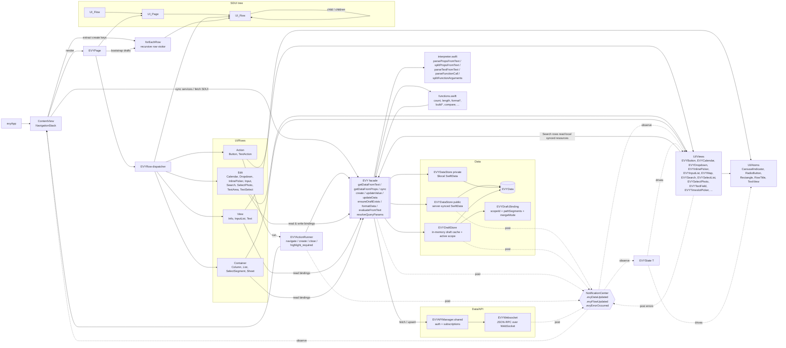

# evy iOS App

iOS consumer app. Minimum iOS version supported: **17.0** (matches `IPHONEOS_DEPLOYMENT_TARGET` in `evy.xcodeproj`).

For local and e2e runs, set `API_HOST` in the repository root `.env` (see [README § Setup](../README.md#setup); e.g. `API_HOST=localhost:8000`).

**Types:** Schema and codegen are documented in [`docs/evy/types.md`](../docs/evy/types.md) and [`docs/evy/sdui/readme.md`](../docs/evy/sdui/readme.md). Run `bun run types:generate` from the repo root after cloning or schema changes ([Shared type system](../README.md#shared-type-system)). Generated Swift under `types/generated/swift/` is not committed; the app also keeps hand-written `Codable` models (e.g. `EVYFlow`, `EVYPage`, `EVYRow`, `EVYWebsocket`) aligned with `types/schema/`.

### Synced data

At startup, the app calls `sync` and stores each returned resource under a service-qualified key: `<service>:<resource>` (for example, `evy:sdui`, `marketplace:items`, or `marketplace:conditions`). Exact keys are preferred when app code needs a specific backend resource.

Pages can receive query parameters through navigation actions. Query params are passed as the optional third `navigate` argument, mapping plural resource keys to arrays of IDs or `$datum` expressions (for example, `{navigate(flowId, pageId, {"items": [$datum.id]})}`). Query values must use a JSON object (`{"key": ["id"]}`). iOS parses the query into a `[String: [String]]` dictionary. When the page opens, iOS resolves each resource key locally, picks the first ID from the already-synced collection, and stores the matching entity under the same plural key so bindings like `{items}` render the selected row. A generic `"id"` query key scans synced collections and stores the first matching entity under that collection's plural resource key. When no synced collection exists for a query key, iOS stores the raw string array under that key.

SDUI bindings use plural resource-only names such as `{conditions}` or `{timeslots}`. Edit rows write drafts through plural destinations such as `{item.title}` or `{item.condition}`. Those bindings resolve exact local keys first, then explicitly fall back to synced service resources. Search rows and dynamic ListContainer rows read local/synced data from their `source` and render `view.content.child` templates using `{$datum.}`. This keeps local draft/entity data separate from backend catalog data while preserving simple SDUI source strings.

### Draft scopes and draft cache keys

iOS drafts are stored in the in-memory draft cache, separate from public/private SwiftData stores.

Draft scope IDs use `<flowId>:<entityKey>` with a plural entity key (for example, `create-flow:items`). Reserved scopes include `<flowId>:browse`, `app:unscoped`, and `ephemeral:<uuid>`.

Full internal draft cache keys append the mode/path segment with another colon: `<flowId>:<entityKey>:<modeFlag><base64Path>` (for example, `create-flow:items:aWyJ0aXRsZSJd`). Because scope IDs also contain `:`, draft key parsing splits on the last colon. The mode flag is `a` for alias-flat merge mode or `e` for explicit-path merge mode; the remaining path key is the base64-encoded JSON path.

These draft keys are distinct from service-qualified data keys like `marketplace:items` and SDUI binding prefixes like `{$local:address}`.

### Architecture

```mermaid
flowchart LR
    App[evyApp]
    Content[ContentView<br/>NavigationStack]
    App --> Content

    subgraph sdui [SDUI tree]
        Flow[UI_Flow]
        Page[UI_Page]
        Row[UI_Row]
        Flow --> Page --> Row
        Row -->|child / children| Row
    end

    Content -->|sync services / fetch SDUI| EVY
    Content -->|render| EVYPage
    EVYPage --> Page
    EVYPage --> EVYRow[EVYRow dispatcher]
    EVYRow --> Row

    subgraph rows [UI/Rows]
        Action[Action<br/>Button, TextAction]
        Container[Container<br/>Column, List, SelectSegment, Sheet]
        Edit[Edit<br/>Calendar, Dropdown, InlinePicker, Input,<br/>Search, SelectPhoto, TextArea, TextSelect]
        ViewRows[View<br/>Info, InputList, Text]
    end
    EVYRow --> Action
    EVYRow --> Container
    EVYRow --> Edit
    EVYRow --> ViewRows

    Views[UI/Views<br/>EVYButton, EVYCalendar, EVYDropdown, EVYInlinePicker,<br/>EVYInputList, EVYMap, EVYSearch, EVYSelectList,<br/>EVYSelectPhoto, EVYTextField, EVYTimeslotPicker, ...]
    Atoms[UI/Atoms<br/>CarouselIndicator, RadioButton,<br/>Rectangle, RowTitle, TextView]
    Action --> Views
    Edit --> Views
    Container --> Views
    ViewRows --> Atoms
    Views --> Atoms

    EVY[[EVY facade<br/>getDataFromText / getDataFromProps / sync<br/>create / updateValue / updateData<br/>ensureDraftExists / formatData / evaluateFromText<br/>resolveQueryParams]]
    Action -->|run| Runner[EVYActionRunner<br/>navigate / create / close /<br/>highlight_required]
    Runner --> Content
    Runner --> EVY

    Edit -->|read & write bindings| EVY
    ViewRows -->|read bindings| EVY
    Container -->|read bindings| EVY

    Interpreter[interpreter.swift<br/>parsePropsFromText / splitPropsFromText /<br/>parseTextFromText / parseFunctionCall /<br/>splitFunctionArguments]
    Functions[functions.swift<br/>count, length, format*,<br/>build*, compare, ...]
    EVY --> Interpreter
    EVY --> Functions
    Functions --> EVY

    RowVisitor[forEachRow<br/>recursive row visitor]
    Content -->|extract create keys| RowVisitor
    EVYPage -->|bootstrap drafts| RowVisitor
    RowVisitor --> Row

    subgraph data [Data]
        PublicStore[EVYDataStore public<br/>server-synced SwiftData]
        PrivateStore[EVYDataStore private<br/>$local SwiftData]
        DraftStore[EVYDraftStore<br/>in-memory draft cache + active scope]
        EntityModel[(EVYData)]
        DraftPath[EVYDraft.Binding<br/>scopeId + pathSegments + mergeMode]
        PublicStore --> EntityModel
        PrivateStore --> EntityModel
        DraftStore --> EntityModel
        DraftStore --> DraftPath
    end
    EVY --> PublicStore
    EVY --> PrivateStore
    EVY --> DraftStore

    Views -->|Search rows read local synced resources| EVY

    subgraph api [Data/API]
        APIManager[EVYAPIManager.shared<br/>auth + subscriptions]
        WS[EVYWebsocket<br/>JSON-RPC over WebSocket]
        APIManager --> WS
    end
    EVY -->|fetch / upsert| APIManager

    Notif{{NotificationCenter<br/>.evyDataUpdated<br/>.evyFlowUpdated<br/>.evyErrorOccurred}}
    PublicStore -. post .-> Notif
    DraftStore -. post .-> Notif
    EVY -. post .-> Notif
    Runner -. post .-> Notif
    WS -. post .-> Notif
    Views -. post errors .-> Notif
    Notif -. observe .-> Content
    Notif -. observe .-> EVYState["EVYState T"]
    Notif -. observe .-> Views
    EVYState -. drives .-> Views
    EVYState -. drives .-> Atoms
```
