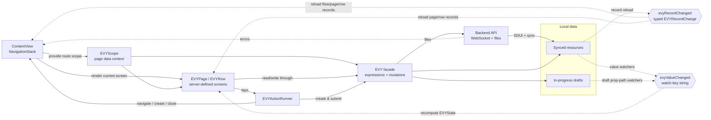

# evy iOS App

The EVY app! Open Xcode, hit run, and Bob's your uncle.

### One piece of behaviour that is not server-driven

Almost everything the app shows comes from synced flows. The exception is
[`EVY+MessageRequests.swift`](evy/Core/EVY+MessageRequests.swift): who may accept or reject a
transfer request, and what answering one does. If you are looking for the flow that puts the
accept/reject buttons on a message row, there isn't one — the file explains the three gaps in
SDUI that keep it here, and [`docs/evy/sdui.md`](../docs/evy/sdui.md#swipe-swipe-left) records
the same thing from the flow-authoring side.

### Prerequisites

The Xcode project references generated Swift types under `types/generated/swift`, which are gitignored and produced by codegen. On a fresh checkout, run this from the repo root **before** opening Xcode or building:

```sh
bun run types:generate
```

### Editor / LSP setup (Zed, Neovim, VS Code, etc.)

`sourcekit-lsp` needs a BSP server to see types across files in this `.xcodeproj` (otherwise it falls back to single-file mode and reports spurious "Cannot find type … in scope" warnings). We use [`xcode-build-server`](https://github.com/SolaWing/xcode-build-server) to bridge `xcodebuild` to sourcekit-lsp.

Install it once (Homebrew):

```sh
brew install xcode-build-server
```

Then regenerate the BSP manifest from the `ios/` directory (do this after switching branches that change build settings, adding files, or modifying the project):

```sh
cd ios
xcode-build-server config -scheme evy -project evy.xcodeproj
```

This writes `ios/buildServer.json` (gitignored, machine-specific). Restart your editor and sourcekit-lsp will pick it up automatically.

### Build

Open `ios/evy.xcodeproj` in Xcode and run the `evy` scheme against the **iPhone 17** simulator on **iOS 26.5** (see root `AGENTS.md`), or from the command line:

```sh
xcodebuild -project ios/evy.xcodeproj -scheme evy -destination 'platform=iOS Simulator,name=iPhone 17' build
```

### Tests

Run the `evyTests` unit test target:

```sh
xcodebuild test -project ios/evy.xcodeproj -scheme evy -destination 'platform=iOS Simulator,name=iPhone 17' -only-testing:evyTests
```

The `e2e` (XCUITest) target additionally requires backend services running; see the root `run-e2e.sh`.

> Unit suites that exercise `EVY.create` / `EVY.update` must call `installHermeticMutationSync()` in `setUp` (see `XCTestCase+UniqueKey.swift`). Without it those mutations fire real RPCs at `localhost:8000` and leave junk rows in the dev database — reseed with `bun run db:seed` if that happens.

### Architecture


```mermaid
flowchart LR
    App[ContentView<br/>NavigationStack]
    SDUI[EVYPage / EVYRow<br/>server-defined screens]
    Actions[EVYActionRunner]
    EVY[EVY facade<br/>expressions + mutations]
    Scope[EVYScope<br/>page data context]
    API[Backend API<br/>WebSocket + files]

    subgraph data [Local data]
        direction TB
        Synced[Synced resources]
        Drafts[In-progress drafts]
    end

    Record{{evyRecordChanged<br/>typed EVYRecordChange}}
    Value{{evyValueChanged<br/>watch-key string}}

    API -->|SDUI + sync| Synced
    App -->|render current screen| SDUI
    App -->|provide route scope| Scope
    Scope --> SDUI
    Scope --> EVY

    SDUI -->|read/write through| EVY
    SDUI -->|taps| Actions
    Actions -->|navigate / create / close| App
    Actions -->|create & submit| EVY

    EVY --> Synced
    EVY --> Drafts
    EVY -->|files| API

    Synced -.->|record reload| Record
    Synced -.->|value watchers| Value
    Drafts -.->|draft prop-path watchers| Value
    Record -.->|reload flow/page/row records| App
    Record -.->|reload page/row records| SDUI
    Value -.->|recompute EVYState| SDUI
    API -.->|errors| App
```

### Architectural highlights

**sync**: At startup, the app calls the API and stores each returned resource under a service-qualified `namespace` / `resource` pair — for example namespace `[evy_core_service_id]` with resources `flows`, `pages`, `rows`, or namespace `[marketplace_service_id]` with resource `[items_resource_id]`. A successful sync also persists the aggregated service/resource catalog singleton under the core `resources` key. (These are two separate stored columns; the colon form `namespace:resource` is only a binding grammar for expressions.) After startup, changes arrive continuously as `dataChanged` push notifications over the same socket and are applied straight into the stores; a full sync runs again on next launch.

**page scope**: Each rendered page carries an `EVYScope` with the cache scope for page query params and the draft scope for create flows. This keeps route context explicit through the SwiftUI tree while preserving the existing expression and mutation entry points.

**change propagation**: Record reloads and expression watchers use separate NotificationCenter channels. `evyRecordChanged` carries a typed `EVYRecordChange` for flow/page/row reloads; `evyValueChanged` carries a watch-key string for `EVYState` recomputation, including resource collection changes and draft prop-path updates.

**page parameters**: Pages can receive query parameters through navigation actions, think of them like URL query parameters in web. They get resolved against resources already synced by the app, or draft data in progress (eg a booking you are in the process of making).

**file uploads**: send binary frames over the authenticated WebSocket and finalise with a `create` RPC. If finalisation fails, a `cancelUpload` RPC cleans up the staged upload. Remote files are fetched via a `get` RPC and cached locally for rendering.
