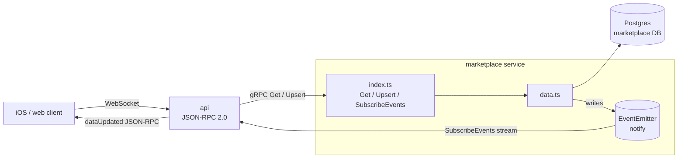

# EVY Marketplace service

gRPC server for marketplace domain data only (catalog rows such as items, conditions, tags, selling reasons). SDUI flows are stored and served by the main [`api`](../../api/README.md). The marketplace service implements `evy.Service` from [`types/schema/service.proto`](../../types/schema/service.proto); the `api` registers a gRPC client in [`api/src/services.ts`](../../api/src/services.ts) (using `MARKETPLACE_GRPC_HOST` and `MARKETPLACE_GRPC_PORT`) and proxies non-SDUI marketplace traffic here. Clients still use WebSockets only to the main `api`.

## Architecture



- `Get` / `Upsert` are unary RPCs that mirror the main `api`'s `GetRequest` / `UpsertRequest`, with payloads JSON-encoded over the wire (`data_json`, `result_json`).
- `SubscribeEvents` is a server-streaming RPC. Each successful `Upsert` emits `dataUpdated` onto an in-process `EventEmitter` that fans the change out to every open stream; `api/src/services.ts` reconnects with exponential backoff if the stream drops.

## Environment

Uses the root `.env`. For `MARKETPLACE_GRPC_*` (dial vs bind, local vs Compose), see [README § Running Services](../../README.md#running-services) and [`.env.example`](../../.env.example).

- `MARKETPLACE_GRPC_HOST` / `MARKETPLACE_GRPC_PORT` — listen address/port for this process (Compose may override bind; the API uses the same keys as a **client** target—see root docs)
- `DB_*` — Postgres credentials; this service’s database name is `DB_MARKETPLACE_DATABASE`

## Scripts

Same scripts as [`api`](../../api/README.md#available-scripts): `bun run dev`, `bun run db:migrate`, `bun run health`, etc.

## Docker

From repo root:

```bash
docker compose -f services/marketplace/compose.yml up --build
```

The dev stack in the repo root also builds this service; see root `docker-compose.yml`.
