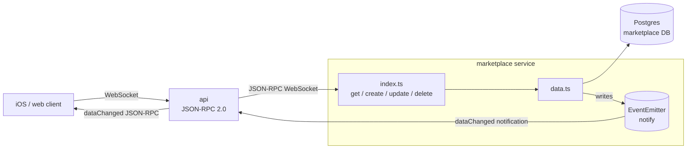

# EVY Marketplace service

API powering the EVY marketplace to buy and sell your stuff.

## Architecture


```mermaid
flowchart LR
    client[iOS / web client]
    api[api<br />JSON-RPC 2.0]

    subgraph marketplace [marketplace service]
        rpc[index.ts<br />get / create / update / delete]
        data[data.ts]
        bus[(EventEmitter<br />notify)]
    end

    pg[(Postgres<br />marketplace DB)]

    client -- WebSocket --> api
    api -- JSON-RPC WebSocket --> rpc
    rpc --> data
    data --> pg
    data -- writes --> bus
    bus -- dataChanged notification --> api
    api -- dataChanged JSON-RPC --> client
```

## Environment

Uses the root `.env` (copy from [`.env.example`](../../.env.example)). See the [root README](../../README.md) for configuration notes.

## Scripts

Same scripts as [`api`](../../api/README.md#available-scripts): `bun run dev`, `bun run db:migrate`, `bun run health`, etc.

## Resource manifest

Marketplace service and resource IDs are runtime values owned in `src/resources.ts`. External consumers discover them through the API gateway's `resources` JSON-RPC method (and the catalog included on successful `sync`); they must not import this module.

The only non-service consumer is `scripts/seed.ts`, which reads the descriptor at bootstrap before the marketplace RPC server starts.

From repo root:

```bash
docker compose -f services/marketplace/compose.yml up --build
```

The dev stack in the repo root also builds this service. See the root `docker-compose.yml`.
