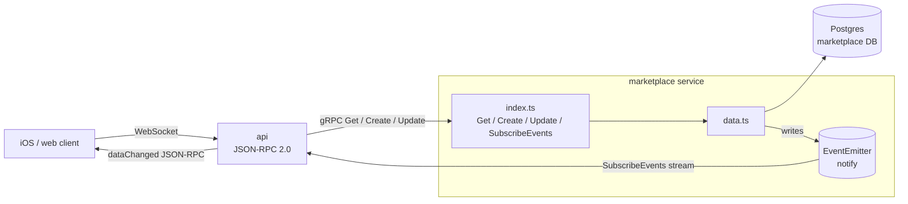

# EVY Marketplace service

gRPC server for marketplace domain data only (resource rows such as items, conditions, tags, selling reasons). SDUI flows are stored and served by the main [`api`](../../api/README.md). The marketplace service implements `evy.Service` from [`types/schema/service.proto`](../../types/schema/service.proto); the `api` registers a gRPC client in [`api/src/procedures/services.ts`](../../api/src/procedures/services.ts) (using `MARKETPLACE_GRPC_HOST` and `MARKETPLACE_GRPC_PORT`) and proxies non-SDUI marketplace traffic here. Clients still use WebSockets only to the main `api`.

## Architecture


```mermaid
flowchart LR
    client[iOS / web client]
    api[api<br/>JSON-RPC 2.0]

    subgraph marketplace [marketplace service]
        grpc[index.ts<br/>Get / Create / Update / SubscribeEvents]
        data[data.ts]
        bus[(EventEmitter<br/>notify)]
    end

    pg[(Postgres<br/>marketplace DB)]

    client -- WebSocket --> api
    api -- gRPC Get / Create / Update --> grpc
    grpc --> data
    data --> pg
    data -- writes --> bus
    bus -- SubscribeEvents stream --> api
    api -- dataChanged JSON-RPC --> client
```

- `Get`, `Create`, and `Update` are unary RPCs that mirror the main `api`'s `GetRequest`, `CreateRequest`, and `UpdateRequest`, with payloads JSON-encoded over the wire (`data_json`, `result_json`). Filters support a singular `id` for one row and `updated_after` / `updatedAfter` for incremental reads; plural ID filtering is not part of the contract.
- `ListResources` advertises the resource names in [`src/resources.ts`](./src/resources.ts). The API loads those names into its runtime service/resource registry before forwarding marketplace calls.
- `SubscribeEvents` is a server-streaming RPC. Each successful data-layer write emits `dataChanged` with `{ service, resource, operation, value }` onto an in-process `EventEmitter` that fans the change out to every open stream; `api/src/procedures/services.ts` reconnects with exponential backoff if the stream drops.

## Environment

Uses the root `.env`. For `MARKETPLACE_GRPC_*` (dial vs bind, local vs Compose), see [README § Running Services](../../README.md#running-services) and [`.env.example`](../../.env.example).

- `MARKETPLACE_GRPC_HOST` / `MARKETPLACE_GRPC_PORT` — listen address/port for this process (Compose may override bind; the API uses the same keys as a **client** target—see root docs)
- `DB_*` — Postgres credentials; this service’s database name is `DB_MARKETPLACE_DATABASE`

The marketplace service stores domain resources in a generic `Data` table defined in [`src/db.ts`](./src/db.ts). Seed data is partitioned by the resource names exported from [`src/resources.ts`](./src/resources.ts), so marketplace rows stay out of the evy core API database.

## Scripts

Same scripts as [`api`](../../api/README.md#available-scripts): `bun run dev`, `bun run db:migrate`, `bun run health`, etc.

## Docker

From repo root:

```bash
docker compose -f services/marketplace/compose.yml up --build
```

The dev stack in the repo root also builds this service; see root `docker-compose.yml`.
