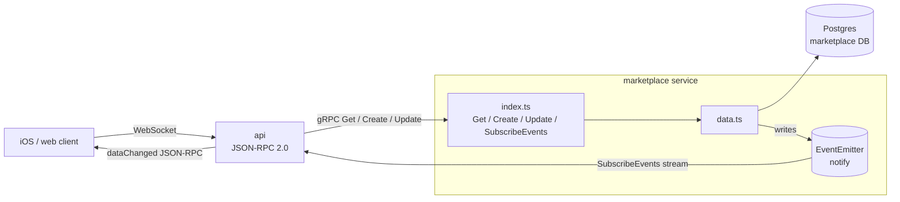

# EVY Marketplace service

gRPC server for marketplace domain data (items, conditions, tags, selling reasons). SDUI flows and evy core resources are served by the main [`api`](../../api/README.md).

## Architecture


```mermaid
flowchart LR
    client[iOS / web client]
    api[api<br />JSON-RPC 2.0]

    subgraph marketplace [marketplace service]
        grpc[index.ts<br />Get / Create / Update / SubscribeEvents]
        data[data.ts]
        bus[(EventEmitter<br />notify)]
    end

    pg[(Postgres<br />marketplace DB)]

    client -- WebSocket --> api
    api -- gRPC Get / Create / Update --> grpc
    grpc --> data
    data --> pg
    data -- writes --> bus
    bus -- SubscribeEvents stream --> api
    api -- dataChanged JSON-RPC --> client
```

The service implements `evy.Service` from [`types/schema/service.proto`](../../types/schema/service.proto). Its gRPC methods are `Get`, `Create`, `Update`, and `SubscribeEvents`: `Get`, `Create`, and `Update` are unary RPCs with JSON-encoded payloads, while `SubscribeEvents` is a server-streaming RPC that pushes `dataChanged` events to the `api` after each successful write. Resource metadata is owned by the API core `serviceResources` table.

## Environment

Uses the root `.env` (copy from [`.env.example`](../../.env.example)). See the [root README](../../README.md) for configuration notes.

## Scripts

Same scripts as [`api`](../../api/README.md#available-scripts): `bun run dev`, `bun run db:migrate`, `bun run health`, etc.

## Docker

From repo root:

```bash
docker compose -f services/marketplace/compose.yml up --build
```

The dev stack in the repo root also builds this service. See the root `docker-compose.yml`.
