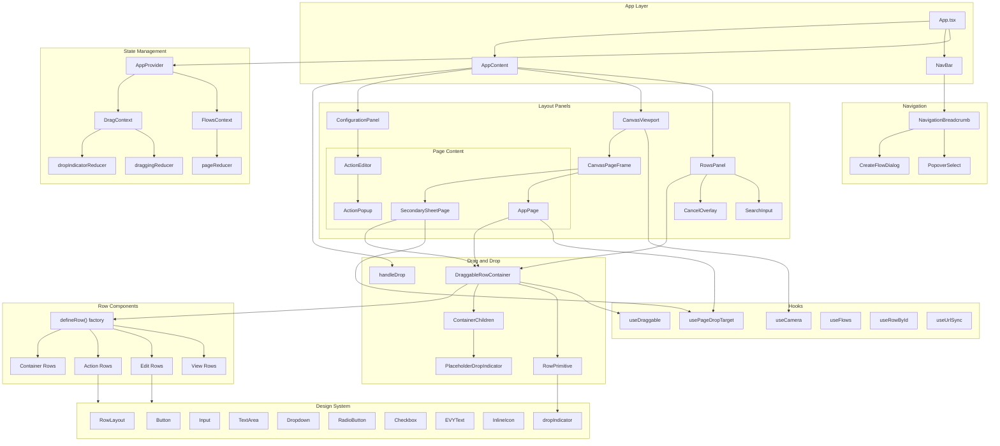

# EVY Web

A React-based app builder.

Shared types (`UI_Flow`, `UI_Page`, `UI_Row`, `DATA_EVY_*` rows, RPC payloads) come from the schema-generated `evy-types` package (see `tsconfig.json` path alias to `../types/generated/ts`).

## Architecture



### Key Components

| Component              | Description                                                         |
| ---------------------- | ------------------------------------------------------------------- |
| App                | Main entry point, sets up layout with header and three-panel design |
| NavBar             | Top bar with logo and breadcrumb navigation                         |
| NavigationBreadcrumb | Flow/page/row breadcrumb with flow selector and focus mode toggle |
| AppProvider        | React context provider managing flows, rows, drag state, focus mode, and config stack |
| RowsPanel          | Left sidebar displaying available row components with search        |
| AppPage            | Center panel showing phone preview with draggable rows              |
| SecondarySheetPage | Secondary phone preview for sheet content in focus mode             |
| ConfigurationPanel | Right sidebar for editing row properties, page titles, and actions  |
| ActionEditor       | Action configuration UI within the configuration panel              |
| useDraggable       | Custom hook encapsulating drag-and-drop behavior                    |
| usePageDropTarget  | Hook setting up page-level drop targets for drag-and-drop           |
| defineRow          | Factory function used to declare all row components                 |

## Getting Started

### Prerequisites

- [Bun](https://bun.sh/) installed on your system
- A running EVY API (or full stack via Docker Compose). The web app talks to the API over `API_URL`; it does not connect to Postgres directly.

### Environment Variables

Ensure your root env file (`../.env`) is set with the .env.example. The following environment variables are used by the Web:

```env
WEB_PORT=3000
# WebSocket URL to the API (see root `.env.example`, e.g. ws://localhost:8000)
API_URL=ws://localhost:8000
```

### Running dev app with hot-reload

```bash
bun run dev
```

Open [http://localhost:3000](http://localhost:3000) with your browser to see the result.

### Docker

The image is built from the **repository root** (the Dockerfile copies `types/schema`, root `package.json`, and `scripts/` for `bun run types:generate`).

```bash
# From the repo root (not from web/)
docker build -f web/Dockerfile -t evy-web \
  --build-arg API_URL=ws://host.docker.internal:8000 \
  .
docker run -p 3000:3000 \
  -e WEB_PORT=3000 \
  -e API_URL=ws://host.docker.internal:8000 \
  evy-web
```

`web/dev/server.ts` requires `WEB_PORT` and `API_URL` at runtime. Adjust `API_URL` if the API is reachable on another host or port. CI builds with `context: .` and `file: web/Dockerfile` (see `.github/workflows/push-docker-images.yml`).

### Docker Compose

From the repo root (the web app has no `docker-compose.yml` in its directory):

```bash
docker compose up -d web
```

You can configure the port via the `WEB_PORT` environment variable (default: 3000).

## Testing

Tests are split into two layers:

- **`test:unit`** — Bun’s test runner on `app/**/*.test.ts` (no live API; `__API_URL__` is stubbed).
- **`test:integration`** — Playwright against `tests/` (browser tests; expects the app/API per `playwright.config` / env).
- **`test:e2e`** — Playwright against `e2e/`.

`bun run test` runs **`test:unit` then `test:integration`** (see `package.json`). CI runs those steps separately (`.github/workflows/web_tests.yml`).

Install Chromium and its system dependencies (not needed in CI — the CI image has them pre-installed):

```bash
bun run test:setup
```

Playwright UI / debug modes apply to the Playwright CLI, not to the compound `test` script. Examples:

```bash
bun run test:integration -- --ui
bun run test:integration -- --debug
bun run test:e2e -- --ui
```

## Available Scripts

| Script                 | Description                              |
| ---------------------- | ---------------------------------------- |
| `bun run dev`          | Start the web app in development mode    |
| `bun run build`        | Build the production assets into `dist/` |
| `bun run start`        | Start the web app using the Bun server   |
| `bun run lint`         | Run Biome checks across the project      |
| `bun run format`       | Format the project with Biome            |
| `bun run setup`        | Copy static assets into `dist/`          |
| `bun run test`         | Run unit tests (`test:unit`) then Playwright integration tests (`test:integration`) |
| `bun run test:unit`    | Run Bun unit tests under `app/`          |
| `bun run test:integration` | Run Playwright tests under `tests/`  |
| `bun run test:e2e`     | Run Playwright end-to-end tests under `e2e/` |
| `bun run test:setup`   | Install Playwright Chromium dependencies |
