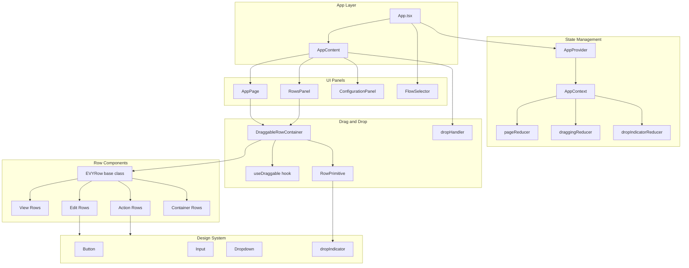

# EVY Web

A React-based app builder built with Bun.

## Architecture



### Key Components

| Component              | Description                                                         |
| ---------------------- | ------------------------------------------------------------------- |
| **App**                | Main entry point, sets up layout with header and three-panel design |
| **AppProvider**        | React context provider managing flows, rows, and drag state         |
| **RowsPanel**          | Left sidebar displaying available row components                    |
| **AppPage**            | Center panel showing phone preview with draggable rows              |
| **ConfigurationPanel** | Right sidebar for editing selected row properties                   |
| **useDraggable**       | Custom hook encapsulating drag-and-drop behavior                    |
| **EVYRow**             | Abstract base class for all row components                          |

### Row Categories

-   **View Rows**: Display-only components (TextRow, InfoRow, InputListRow)
-   **Edit Rows**: Form input components (InputRow, DropdownRow, CalendarRow, etc.)
-   **Action Rows**: Interactive components (ButtonRow, TextActionRow)
-   **Container Rows**: Layout components that hold child rows (ListContainer, ColumnContainer, etc.)

## Getting Started

### Prerequisites

-   [Bun](https://bun.sh/) installed on your system

### Installation

```bash
bun install
```

### Running the App

#### Development Mode

```bash
bun run dev
```

This will build the application and start the dev server with hot reloading.

#### Production Mode

```bash
bun run build
bun run prod
```

Open [http://localhost:3000](http://localhost:3000) with your browser to see the result.

### Docker

#### Build and Run

```bash
docker build -t evy-web .
docker run -p 3000:3000 evy-web
```

#### Using Docker Compose

```bash
docker compose up -d
```

You can configure the port via the `WEB_PORT` environment variable (default: 3000).

## Testing

This project includes comprehensive end-to-end tests using Playwright.

### Setup

```bash
bun run test:setup
```

### Running Tests

```bash
bun run test
```

To run the tests with UI or debug mode:

```bash
bun run test:ui
bun run test:debug
```

## License

Apache 2.0, see [LICENSE](LICENSE) for more details.
