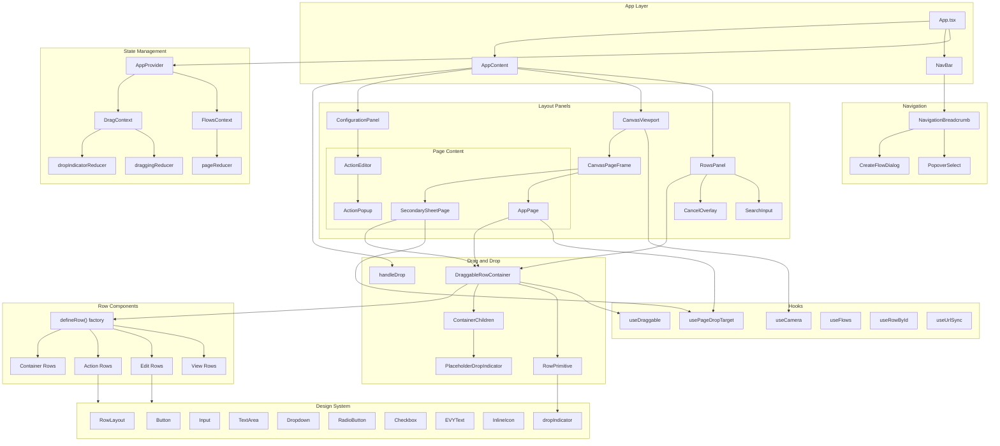

# EVY Web

A React-based app builder built with Bun.

Shared types (`SDUI_Flow`, `SDUI_Page`, `SDUI_Row`, RPC payloads) come from the schema-generated `evy-types` package (see `tsconfig.json` path alias to `../types/generated/ts`). After changing schemas in `types/schema/`, run `bun run types:generate` from the repo root and commit the updated generated files.

## Architecture



### Key Components

| Component              | Description                                                         |
| ---------------------- | ------------------------------------------------------------------- |
| **App**                | Main entry point, sets up layout with header and three-panel design |
| **NavBar**             | Top bar with logo and breadcrumb navigation                         |
| **NavigationBreadcrumb** | Flow/page/row breadcrumb with flow selector and focus mode toggle |
| **AppProvider**        | React context provider managing flows, rows, drag state, focus mode, and config stack |
| **RowsPanel**          | Left sidebar displaying available row components with search        |
| **AppPage**            | Center panel showing phone preview with draggable rows              |
| **SecondarySheetPage** | Secondary phone preview for sheet content in focus mode             |
| **ConfigurationPanel** | Right sidebar for editing row properties, page titles, and actions  |
| **ActionEditor**       | Action configuration UI within the configuration panel              |
| **useDraggable**       | Custom hook encapsulating drag-and-drop behavior                    |
| **usePageDropTarget**  | Hook setting up page-level drop targets for drag-and-drop           |
| **defineRow**          | Factory function used to declare all row components                 |

### Row Categories

- **View Rows**: Display-only components (TextRow, InfoRow, InputListRow)
- **Edit Rows**: Form input components (InputRow, DropdownRow, CalendarRow, TextAreaRow, SearchRow, SelectPhotoRow, InlinePickerRow, TextSelectRow)
- **Action Rows**: Interactive components (ButtonRow, TextActionRow)
- **Container Rows**: Layout components that hold child rows (ListContainerRow, ColumnContainerRow, SheetContainerRow, SelectSegmentContainerRow)

## Getting Started

### Prerequisites

- [Bun](https://bun.sh/) installed on your system

### Installation

```bash
bun install
```

Create a root `.env` file at the repository root (`../.env` from the `web` directory). The web scripts load environment variables from this shared root env file.

### Running the App

#### Development Mode

```bash
bun run dev
```

This will build the application and start the dev server with hot reloading.

#### Production Mode

```bash
bun run build
bun run start
```

Open [http://localhost:3000](http://localhost:3000) with your browser to see the result.

### Docker

#### Build and Run

```bash
docker build -t evy-web .
docker run -p 3000:3000 evy-web
```

#### Using Docker Compose

From the repo root (the web app has no `docker-compose.yml` in its directory):

```bash
docker compose up -d
```

You can configure the port via the `WEB_PORT` environment variable (default: 3000).

## Testing

This project uses Playwright for both component tests and end-to-end tests.

### Setup (local only)

Install Chromium and its system dependencies (not needed in CI -- the CI image has them pre-installed):

```bash
bun run test:setup
```

### Running Tests

Component and integration tests (`tests/`):

```bash
bun run test
```

End-to-end tests (`e2e/`) -- requires the full stack to be running (see [root README](../README.md#e2e-tests)):

```bash
bun run test:e2e
```

To run the component tests with UI or debug mode:

```bash
bun run test --ui
bun run test --debug
```

## License

Licensed under GPL-3.0-only; see [LICENSE](LICENSE) and the repository root [LICENSE](../LICENSE).
