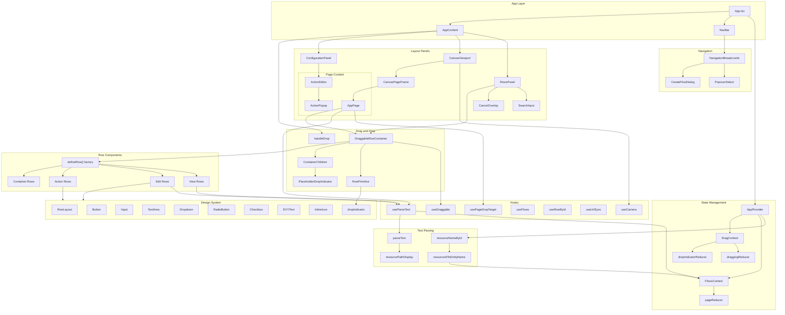

# EVY Web

A React-based app builder.

See [`docs/evy/data.md`](../docs/evy/data.md) for shared contracts and codegen.

## Architecture


```mermaid
graph TD
    subgraph app [App Layer]
        App[App.tsx]
        NavBar[NavBar]
        AppContent[AppContent]
    end

    subgraph state [State Management]
        AppProvider[AppProvider]
        FlowsContext[FlowsContext]
        DragContext[DragContext]
        PageReducer[pageReducer]
        DraggingReducer[draggingReducer]
        DropIndicatorReducer[dropIndicatorReducer]
    end

    subgraph nav [Navigation]
        NavigationBreadcrumb[NavigationBreadcrumb]
        PopoverSelect[PopoverSelect]
        CreateFlowDialog[CreateFlowDialog]
    end

    subgraph layout [Layout Panels]
        RowsPanel[RowsPanel]
        SearchInput[SearchInput]
        CancelOverlay[CancelOverlay]
        CanvasViewport[CanvasViewport]
        CanvasPageFrame[CanvasPageFrame]
        ConfigPanel[ConfigurationPanel]

        subgraph pages [Page Content]
            AppPage[AppPage]
            ActionEditor[ActionEditor]
            ActionPopup[ActionPopup]
        end
    end

    subgraph hooks [Hooks]
        useCamera[useCamera]
        usePageDropTarget[usePageDropTarget]
        useDraggable[useDraggable]
        useFlows[useFlows]
        useRowById[useRowById]
        useUrlSync[useUrlSync]
        useParseText[useParseText]
    end

    subgraph dragdrop [Drag and Drop]
        DraggableRowContainer[DraggableRowContainer]
        ContainerChildren[ContainerChildren]
        RowPrimitive[RowPrimitive]
        PlaceholderDropIndicator[PlaceholderDropIndicator]
        DropHandler[handleDrop]
    end

    subgraph rows [Row Components]
        defineRow["defineRow() factory"]
        ViewRows[View Rows]
        EditRows[Edit Rows]
        ActionRows[Action Rows]
        ContainerRows[Container Rows]
    end

    subgraph designsystem [Design System]
        RowLayout[RowLayout]
        Button[Button]
        Input[Input]
        TextAreaDS[TextArea]
        Dropdown[Dropdown]
        RadioButton[RadioButton]
        Checkbox[Checkbox]
        EVYText[EVYText]
        InlineIcon[InlineIcon]
        DropIndicator[dropIndicator]
    end

    subgraph parsing [Text Parsing]
        ResourceNames[resourceNameById]
        ResourceMap[resourceIdToEntityName]
        ParseText[parseText]
        ResourcePathDisplay[resourcePathDisplay]
    end

    App --> AppProvider
    AppProvider --> ResourceNames
    ResourceNames --> ResourceMap
    ResourceMap --> FlowsContext
    AppProvider --> FlowsContext
    AppProvider --> DragContext
    FlowsContext --> PageReducer
    DragContext --> DraggingReducer
    DragContext --> DropIndicatorReducer

    App --> NavBar
    NavBar --> NavigationBreadcrumb
    NavigationBreadcrumb --> PopoverSelect
    NavigationBreadcrumb --> CreateFlowDialog

    App --> AppContent
    AppContent --> RowsPanel
    AppContent --> CanvasViewport
    AppContent --> ConfigPanel
    AppContent --> DropHandler

    RowsPanel --> SearchInput
    RowsPanel --> CancelOverlay
    RowsPanel --> DraggableRowContainer

    CanvasViewport --> useCamera
    CanvasViewport --> CanvasPageFrame
    CanvasPageFrame --> AppPage

    AppPage --> usePageDropTarget
    AppPage --> useParseText
    AppPage --> DraggableRowContainer

    ConfigPanel --> ActionEditor
    ActionEditor --> ActionPopup

    DraggableRowContainer --> useDraggable
    DraggableRowContainer --> RowPrimitive
    DraggableRowContainer --> ContainerChildren
    ContainerChildren --> PlaceholderDropIndicator

    DraggableRowContainer --> defineRow
    defineRow --> ViewRows
    defineRow --> EditRows
    defineRow --> ActionRows
    defineRow --> ContainerRows

    RowPrimitive --> DropIndicator
    EditRows --> designsystem
    ActionRows --> designsystem
    ViewRows --> useParseText
    EditRows --> useParseText
    useParseText --> FlowsContext
    useParseText --> ParseText
    ParseText --> ResourcePathDisplay
```

## Getting Started

Setup (Bun, Docker, copying `.env`): [README § Setup](../README.md#setup) and [§ Running Services](../README.md#running-services). The web app only needs a reachable API over `API_URL` (no direct Postgres).

### Environment Variables

From the repo root, copy [`.env.example`](../.env.example) to `.env`. Web-specific:

```env
WEB_PORT=3000
# WebSocket URL to the API (see root `.env.example`, e.g. ws://localhost:8000)
API_URL=ws://localhost:8000
```

### Running dev app with hot-reload

```bash
bun run dev
```

Open [http://localhost:3000](http://localhost:3000) with your browser to see the result.

### Docker

```bash
docker build -f web/Dockerfile -t evy-web \
  --build-arg API_URL=ws://host.docker.internal:8000 \
  .
docker run -p 3000:3000 \
  -e WEB_PORT=3000 \
  -e API_URL=ws://host.docker.internal:8000 \
  evy-web
```

### Docker Compose

Full stack: [README § Development (with Docker Compose)](../README.md#development-with-docker-compose). Web service only:

```bash
docker compose up -d web
```

`WEB_PORT` defaults are set via `.env` (see `.env.example`).

## Testing

Tests are split into three layers:

- **`test:unit`** — Bun's test runner on `app/**/*.test.ts` (`__API_URL__` is stubbed, no live API).
- **`test:integration`** — Playwright against `integration/` (browser tests with mock/injected data, no API required).
- **`test:e2e`** — Playwright against `e2e/` (full-stack tests, requires running API + database). Only run via `./run-e2e.sh`.

Install Chromium and its system dependencies (not needed in CI — the CI image has them pre-installed):

```bash
bun run test:setup
```

Playwright UI / debug modes apply to the Playwright CLI. Examples:

```bash
bun run test:integration -- --ui
bun run test:integration -- --debug
```

## Available Scripts

| Script                 | Description                              |
| ---------------------- | ---------------------------------------- |
| `bun run dev`          | Start the web app in development mode    |
| `bun run build`        | Build the production assets into `dist/` |
| `bun run start`        | Start the web app using the Bun server   |
| `bun run lint`         | Run Biome checks across the project      |
| `bun run format`       | Format the project with Biome            |
| `bun run setup`        | Copy static assets into `dist/`          |
| `bun run test:unit`    | Run Bun unit tests under `app/`          |
| `bun run test:integration` | Run Playwright browser tests under `integration/` |
| `bun run test:e2e`     | Run Playwright full-stack tests under `e2e/` |
| `bun run test:setup`   | Install Playwright Chromium dependencies |
